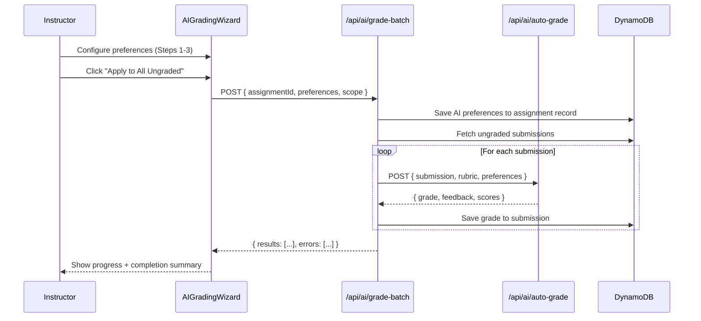
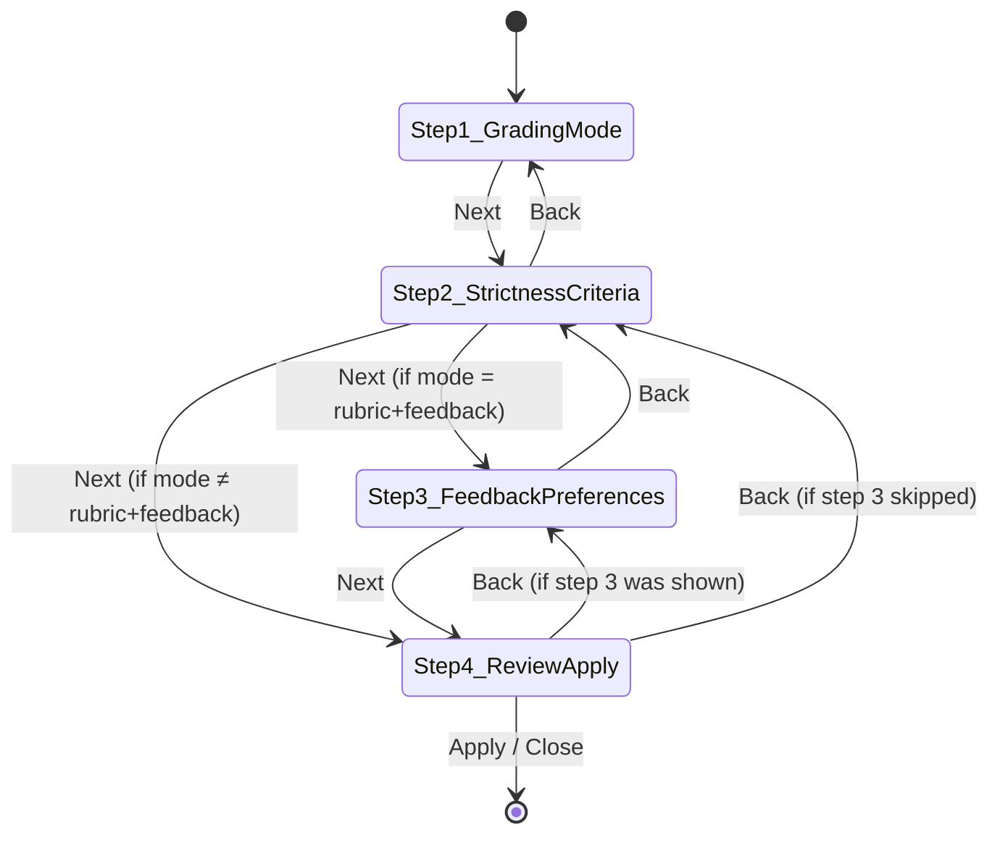

# Design Document: AI Grading Wizard

## Overview

This design describes two interconnected features added to the ClassCast instructor grading page (`/instructor/grading/bulk`):

1. **PeerResponseIndicator** — a small inline component that surfaces peer response requirements and per-student completion status directly on each submission card.
2. **AIGradingWizard** — a 4-step modal dialog for configuring and executing AI-assisted batch grading, with per-assignment preference persistence.

Both features integrate with the existing `BulkGradingContent` page component, existing rubric-based grading infrastructure (`RubricGradingPanel`, `/api/ai/auto-grade`), and the DynamoDB `classcast-assignments` table.

### Design Goals

- Minimal disruption to the existing grading workflow
- Reuse of existing `/api/ai/auto-grade` endpoint with an enhanced request payload
- Per-assignment preference persistence so instructors don't reconfigure each session
- Mobile-first, ClassCast-themed UI (navy #005587, gold #FFC72C, white, Oswald headings, rounded-2xl cards)

---

## Architecture

### High-Level Component Architecture

```mermaid
graph TD
    A[BulkGradingContent page] --> B[PeerResponseIndicator]
    A --> C[AIGradingWizard modal]
    C --> D[Step1_GradingMode]
    C --> E[Step2_StrictnessCriteria]
    C --> F[Step3_FeedbackPreferences]
    C --> G[Step4_ReviewApply]
    G --> H[/api/ai/grade-batch]
    H --> I[/api/ai/auto-grade - per submission]
    G --> J[/api/assignments/:id/ai-preferences - GET/PUT]
    A --> K[/api/submissions - existing]
    B --> K
```

### Data Flow for AI Grading Execution



### Wizard Step Flow



---

## Components and Interfaces

### PeerResponseIndicator

**Location:** `src/components/instructor/PeerResponseIndicator.tsx`

```typescript
interface PeerResponseIndicatorProps {
  enablePeerResponses: boolean;
  minResponsesRequired: number;
  completedCount: number;
}
```

**Behavior:**
- Renders nothing when `enablePeerResponses` is `false`
- Displays "{completedCount} of {minResponsesRequired} complete"
- Success state (green) when `completedCount >= minResponsesRequired`
- Warning state (amber/gold) when `completedCount < minResponsesRequired`
- Compact pill design placed below the video player alongside the existing metadata line

### AIGradingWizard

**Location:** `src/components/instructor/AIGradingWizard.tsx`

```typescript
interface AIGradingWizardProps {
  isOpen: boolean;
  onClose: () => void;
  assignmentId: string;
  assignmentTitle: string;
  rubric: RubricCategory[];
  ungradedCount: number;
  currentSubmissionId?: string;
  onGradingComplete: (results: GradingResult[]) => void;
}

interface GradingResult {
  submissionId: string;
  success: boolean;
  grade?: number;
  rubricScores?: Record<string, number>;
  feedback?: string;
  error?: string;
}
```

**Internal Step Components:**

| Step | Component | Responsibility |
|------|-----------|---------------|
| 1 | `WizardStep1_GradingMode` | Select grading mode (3 radio cards) |
| 2 | `WizardStep2_Strictness` | Strictness slider + keywords/concepts text inputs |
| 3 | `WizardStep3_Feedback` | Formality, length, tone selections (conditional) |
| 4 | `WizardStep4_Review` | Summary + apply buttons + progress indicator |

### WizardStepIndicator

**Location:** Inline within AIGradingWizard

```typescript
interface WizardStepIndicatorProps {
  currentStep: number;
  totalSteps: number; // 3 or 4 depending on mode
  stepLabels: string[];
}
```

Renders a horizontal step bar with numbered circles connected by lines, filled/colored for completed and current steps.

### Integration Point: BulkGradingContent

The existing page component gains:
- An "AI Grade" button in the page header (beside existing filter controls)
- `<PeerResponseIndicator>` rendered per submission card
- `<AIGradingWizard>` rendered conditionally when wizard state is open

---

## Data Models

### AIGradingPreferences (stored on assignment record in DynamoDB)

```typescript
interface AIGradingPreferences {
  gradingMode: 'rubric_only' | 'rubric_feedback' | 'response_grading';
  strictnessLevel: 'lenient' | 'moderate' | 'strict';
  keywords: string[]; // comma-separated input stored as array
  concepts: string[]; // optional concepts stored as array
  feedbackPreferences?: {
    formality: 'casual' | 'professional' | 'academic';
    length: 'brief' | 'standard' | 'detailed';
    tone: 'encouraging' | 'constructive' | 'critical';
  };
  updatedAt: string; // ISO 8601
}
```

**Storage:** Added as a top-level field `aiGradingPreferences` on the assignment item in the `classcast-assignments` DynamoDB table. This avoids creating a new table and leverages existing assignment read/write patterns.

### Enhanced Auto-Grade Request (extended payload to /api/ai/auto-grade)

```typescript
interface EnhancedAutoGradeRequest {
  submission: {
    id: string;
    studentId: string;
    videoUrl: string;
    duration: number;
    assignmentTitle: string;
    peerResponses?: PeerResponseSummary[]; // included for response_grading mode
  };
  rubric: {
    id: string;
    name: string;
    criteria: RubricCriteria[];
    totalPoints: number;
  };
  preferences: {
    gradingMode: 'rubric_only' | 'rubric_feedback' | 'response_grading';
    strictnessLevel: 'lenient' | 'moderate' | 'strict';
    keywords: string[];
    concepts: string[];
    feedbackPreferences?: {
      formality: 'casual' | 'professional' | 'academic';
      length: 'brief' | 'standard' | 'detailed';
      tone: 'encouraging' | 'constructive' | 'critical';
    };
  };
}

interface PeerResponseSummary {
  responseId: string;
  reviewerName: string;
  content: string;
  wordCount: number;
  submittedAt: string;
}
```

### Batch Grading API Request/Response

**Endpoint:** `POST /api/ai/grade-batch`

```typescript
// Request
interface GradeBatchRequest {
  assignmentId: string;
  preferences: AIGradingPreferences;
  scope: 'all_ungraded' | 'single';
  submissionId?: string; // required when scope = 'single'
}

// Response
interface GradeBatchResponse {
  success: boolean;
  results: GradingResult[];
  totalProcessed: number;
  totalErrors: number;
  preferenceSaved: boolean;
}
```

### API Endpoint: GET/PUT /api/assignments/[id]/ai-preferences

```typescript
// GET response
interface GetAIPreferencesResponse {
  success: boolean;
  preferences: AIGradingPreferences | null;
}

// PUT request body = AIGradingPreferences
// PUT response
interface PutAIPreferencesResponse {
  success: boolean;
  updatedAt: string;
}
```

---


## Correctness Properties

*A property is a characteristic or behavior that should hold true across all valid executions of a system — essentially, a formal statement about what the system should do. Properties serve as the bridge between human-readable specifications and machine-verifiable correctness guarantees.*

### Property 1: Peer response indicator format

*For any* submission where `enablePeerResponses` is true, given a `peerResponses` array of length N and a `minResponsesRequired` value M, the PeerResponseIndicator SHALL render the text "{N} of {M} complete" where N equals the array length.

**Validates: Requirements 1.1, 1.3, 2.3**

### Property 2: Peer response indicator visual state

*For any* pair (completedCount, minResponsesRequired) where `enablePeerResponses` is true, the PeerResponseIndicator SHALL apply success styling if and only if `completedCount >= minResponsesRequired`, and warning styling otherwise.

**Validates: Requirements 2.1, 2.2**

### Property 3: Peer response detail completeness

*For any* non-empty array of peer responses, each response rendered on the grading page SHALL display the peer video reference, the response text content, and the submission timestamp.

**Validates: Requirements 3.1, 3.2**

### Property 4: Wizard mode selection validation

*For any* wizard state where `gradingMode` is null/undefined, the "Next" button on Step 1 SHALL be disabled. For any state where a valid mode is selected, the "Next" button SHALL be enabled.

**Validates: Requirements 5.5**

### Property 5: Wizard step skip logic

*For any* `gradingMode` in `['rubric_only', 'response_grading']`, advancing from Step 2 SHALL proceed directly to Step 4 (skipping Step 3). For `gradingMode = 'rubric_feedback'`, advancing from Step 2 SHALL proceed to Step 3.

**Validates: Requirements 7.1, 7.2**

### Property 6: Review step summary completeness

*For any* valid `AIGradingPreferences` configuration, Step 4 of the wizard SHALL display every configured field: grading mode, strictness level, keywords, concepts, and feedback preferences (when applicable).

**Validates: Requirements 8.1**

### Property 7: AI grading preferences round-trip

*For any* valid `AIGradingPreferences` object, saving preferences via the PUT endpoint and then loading them via the GET endpoint SHALL return an equivalent object with all fields preserved.

**Validates: Requirements 9.1, 9.2**

### Property 8: Step indicator correctness

*For any* wizard state at step S with total steps T, the step indicator SHALL display S as the current step and T as the total.

**Validates: Requirements 10.1**

### Property 9: Close without side effects

*For any* wizard step (1 through 4), closing the wizard SHALL not trigger any grading API calls or save preferences.

**Validates: Requirements 10.4**

---

## Error Handling

| Scenario | Behavior |
|----------|----------|
| `/api/ai/grade-batch` returns 500 for individual submission | Mark that submission as errored in results; continue processing remaining submissions. Show partial results to instructor. |
| `/api/ai/auto-grade` times out (>30s per submission) | Abort that submission, mark as error, continue batch. |
| Network failure during batch | Show error state in wizard with retry button. Already-graded submissions retain their grades. |
| AI preferences GET fails | Open wizard with default values (moderate strictness, no keywords). Show subtle toast notification. |
| AI preferences PUT fails | Show error toast; wizard remains open. Instructor can retry or proceed without saving preferences. |
| Invalid rubric (no categories) | Disable "Apply" buttons in Step 4 with tooltip explaining a rubric is required. |
| No ungraded submissions | "Apply to All Ungraded" button disabled with helper text "All submissions already graded". |

### Rate Limiting

The batch endpoint processes submissions sequentially with a 1-second delay between requests to avoid overwhelming the AI service. If more than 50 submissions need grading, the UI shows estimated time and allows cancellation.

---

## Testing Strategy

### Unit Tests (Example-Based)

Focus on specific scenarios and edge cases:

- PeerResponseIndicator renders nothing when `enablePeerResponses = false`
- Empty peer responses shows "No responses submitted" message
- AI grading button exists and opens modal on click
- Step 1 displays all three grading mode options
- Step 2 defaults strictness to "moderate"
- Step 3 displays formality/length/tone selectors
- Step 4 shows both "Apply to All Ungraded" and "Apply to This Submission" buttons
- Back button disabled on Step 1
- Error display and retry on API failure
- Progress indicator appears during batch execution

### Property-Based Tests

Each correctness property above will be implemented as a property-based test using `fast-check`.

**Configuration:**
- Minimum 100 iterations per property test
- Tag format: `Feature: ai-grading-wizard, Property {N}: {description}`

**Library:** `fast-check` (already aligns with the Next.js/TypeScript ecosystem)

**Generators needed:**
- `arbPeerResponsesArray`: Array of 0-20 peer response objects with random content
- `arbMinResponsesRequired`: Integer 1-10
- `arbAIGradingPreferences`: Full preferences object with random valid values
- `arbWizardStep`: Integer 1-4
- `arbGradingMode`: One of the three valid mode strings

### Integration Tests

- Verify `/api/ai/grade-batch` correctly calls `/api/ai/auto-grade` per submission
- Verify AI preferences are persisted to and read from DynamoDB
- Verify batch grading handles partial failures gracefully
- End-to-end wizard flow from open → configure → apply → results displayed

### Smoke Tests

- Wizard opens and renders without crashing
- ClassCast theme colors applied correctly (visual snapshot)
