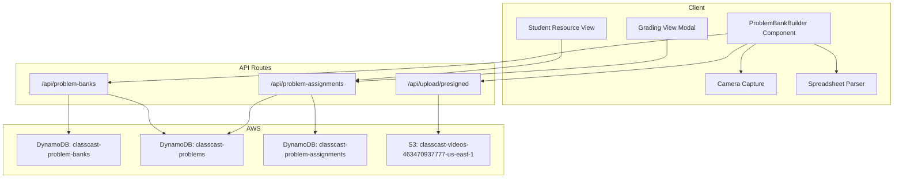

# Design: Individualized Problem Sets

## Overview

Individualized Problem Sets enables instructors to create banks of unique problems and randomly distribute them 1:1 to students within a section. Each student sees only their assigned problem in the Resources section of an assignment. Instructors can reference the assigned problem while grading via a clip icon modal overlay.

The feature introduces three new DynamoDB tables (`classcast-problem-banks`, `classcast-problems`, `classcast-problem-assignments`), new API routes under `/api/problem-banks` and `/api/problem-assignments`, and integrates with the existing assignment detail page, grading page, and S3 presigned URL upload flow.

### Key Design Decisions

1. **Independent Problem Banks**: Banks are standalone entities (not embedded in assignments) for reusability across semesters.
2. **Fisher-Yates Distribution**: Same randomization algorithm already proven in `src/lib/groupAssignment.ts`, adapted for 1:1 mapping instead of groups.
3. **Client-side Spreadsheet Parsing**: CSV/XLS parsing happens in the browser using `Papa Parse` (CSV) and `SheetJS` (XLS) to avoid server-side file handling complexity.
4. **Capacitor Camera Integration**: Uses `@capacitor/camera` for native photo capture on iOS/Android, falling back to `<input type="file" capture>` on web.
5. **Presigned URL Upload**: Problem images follow the existing presigned URL pattern (`/api/upload/presigned`) with a `problem-banks/` folder prefix.

## Architecture



### Integration Points

- **Assignment Detail Page** (`AssignmentDetailsModal.tsx`): Extended to show linked Problem Bank info for instructors.
- **Student Assignment View**: The `resources` section renders the student's assigned problem (text and/or image).
- **Grading Page** (`/api/grading`): Submissions endpoint enriched with problem assignment data; UI shows 📎 icon per student.
- **Assignment Creation Wizard**: New step to optionally link a Problem Bank and trigger distribution.

## Components and Interfaces

### 1. ProblemBankBuilder Component

A full-page or modal component for creating and editing problem banks. Supports four input methods via tabs.

```typescript
interface ProblemBankBuilderProps {
  bankId?: string;              // If editing an existing bank
  courseId: string;
  sectionId?: string;           // For enrollment count comparison
  onSave: (bank: ProblemBank) => void;
  onCancel: () => void;
}

interface ProblemInput {
  id: string;                   // Client-side temp ID (uuid)
  content: string;              // Text content
  imageFile?: File;             // Local file before upload
  imageUrl?: string;            // S3 URL after upload
  orderIndex: number;
}
```

**Tab Structure:**
1. **Paste Text** — Textarea per problem, add/remove rows dynamically
2. **Upload Image** — File picker (PNG, JPG, HEIC), thumbnail preview grid
3. **Take Photo** — Capacitor camera integration, captured photos shown as grid
4. **Upload Spreadsheet** — CSV/XLS file picker, parsed preview table, column mapping

**Enrollment Indicator**: A badge shows `{problemCount}/{enrollmentCount}` with green (match), yellow (surplus), or red (insufficient) coloring.

### 2. Student Resource View (ProblemDisplay)

Renders the student's assigned problem within the existing assignment resources section.

```typescript
interface ProblemDisplayProps {
  problem: {
    problemId: string;
    content: string;
    imageUrl?: string;
  };
}
```

- Text problems render in a styled card with readable typography.
- Image problems render with `next/image` and tap-to-zoom (lightbox modal).
- Fallback message when no problem assigned: "Your problem has not been assigned yet. Please contact your instructor."

### 3. Instructor Grading Problem Modal

A slide-over or modal triggered by a 📎 clip icon on the grading page.

```typescript
interface ProblemReferenceModalProps {
  isOpen: boolean;
  onClose: () => void;
  problem: {
    problemId: string;
    content: string;
    imageUrl?: string;
  } | null;
  studentName: string;
}
```

- Renders as an overlay so the video continues playing underneath.
- Displays problem text and/or image with zoom capability.
- Positioned to not obscure the video player (right side panel or bottom sheet on mobile).

### 4. Camera Capture Component

```typescript
interface CameraCaptureProps {
  onCapture: (file: File) => void;
  maxPhotos?: number;
}
```

- On native (Capacitor): Uses `Camera.getPhoto()` with `CameraSource.Camera`.
- On web: Falls back to `<input type="file" accept="image/*" capture="environment">`.
- Returns a `File` object for uniform handling in both paths.

### 5. Spreadsheet Parser Utility

```typescript
interface ParsedSpreadsheet {
  rows: string[];               // Each row's first column = problem text
  totalRows: number;
  errors: string[];             // Parsing warnings/errors
}

function parseSpreadsheet(file: File): Promise<ParsedSpreadsheet>;
```

- CSV: Parsed with `Papa Parse` (papaparse npm package).
- XLS/XLSX: Parsed with `SheetJS` (xlsx npm package).
- First column of each row is treated as problem text.
- Empty rows are skipped. Header row detection: if first row matches common headers ("Problem", "Question", "#"), it's skipped.

### 6. Problem Distribution Utility

```typescript
/**
 * Randomly assigns problems to students 1:1 using Fisher-Yates shuffle.
 * Similar to groupAssignment.ts but maps problems to students instead of groups.
 */
function distributeProblemSet(
  problemIds: string[],
  studentIds: string[]
): ProblemAssignment[];

interface ProblemAssignment {
  problemId: string;
  studentId: string;
}
```

- Validates `problemIds.length >= studentIds.length` before distribution.
- Fisher-Yates shuffles the problem array, then maps `shuffled[i] → studentIds[i]`.
- Excess problems remain unassigned (available for late-enrolling students).

## Data Models

### DynamoDB Tables

#### classcast-problem-banks

| Attribute     | Type   | Key  | Description                          |
|---------------|--------|------|--------------------------------------|
| bankId        | String | PK   | UUID, partition key                  |
| instructorId  | String | GSI  | For listing banks by instructor      |
| courseId      | String |      | Course association                    |
| title         | String |      | Bank display name                    |
| description   | String |      | Optional description                 |
| problemCount  | Number |      | Denormalized count                   |
| createdAt     | String |      | ISO 8601                             |
| updatedAt     | String |      | ISO 8601                             |

**GSI**: `instructorId-index` (PK: instructorId, SK: createdAt) — for listing all banks by an instructor.

#### classcast-problems

| Attribute   | Type   | Key  | Description                              |
|-------------|--------|------|------------------------------------------|
| problemId   | String | PK   | UUID, partition key                      |
| bankId      | String | GSI  | Foreign key to problem bank              |
| content     | String |      | Problem text content                     |
| imageUrl    | String |      | S3 URL for image-based problems          |
| orderIndex  | Number |      | Display order within the bank            |
| createdAt   | String |      | ISO 8601                                 |

**GSI**: `bankId-index` (PK: bankId, SK: orderIndex) — for fetching all problems in a bank in order.

#### classcast-problem-assignments

| Attribute    | Type   | Key  | Description                              |
|--------------|--------|------|------------------------------------------|
| id           | String | PK   | UUID, partition key                      |
| assignmentId | String | GSI  | For listing all distributions per assignment |
| studentId    | String | GSI  | For student lookup of their problem      |
| problemId    | String |      | Foreign key to problem                   |
| bankId       | String |      | Denormalized for quick reference         |
| assignedAt   | String |      | ISO 8601                                 |

**GSI-1**: `assignmentId-index` (PK: assignmentId, SK: studentId) — for instructor view of full distribution.
**GSI-2**: `studentId-assignmentId-index` (PK: studentId, SK: assignmentId) — for student lookup of their assigned problem.

### S3 Storage

Problem images stored at:
```
s3://classcast-videos-463470937777-us-east-1/problem-banks/{bankId}/{problemId}_{timestamp}.{ext}
```

Uses the existing presigned URL upload pattern from `/api/upload/presigned` with `folder: 'problem-banks/{bankId}'`.

### TypeScript Interfaces

```typescript
// src/types/problemBank.ts

export interface ProblemBank {
  bankId: string;
  instructorId: string;
  courseId: string;
  title: string;
  description?: string;
  problemCount: number;
  createdAt: string;
  updatedAt: string;
}

export interface Problem {
  problemId: string;
  bankId: string;
  content: string;
  imageUrl?: string;
  orderIndex: number;
  createdAt: string;
}

export interface ProblemAssignmentRecord {
  id: string;
  assignmentId: string;
  studentId: string;
  problemId: string;
  bankId: string;
  assignedAt: string;
}
```

## API Endpoints

### Problem Banks CRUD

#### `POST /api/problem-banks`
Create a new problem bank with problems.

**Request:**
```json
{
  "title": "Calculus Integration Problems",
  "description": "Chapter 5 definite integrals",
  "courseId": "course-123",
  "instructorId": "instructor-456",
  "problems": [
    { "content": "Evaluate ∫(0 to 1) x² dx", "imageUrl": null },
    { "content": "", "imageUrl": "https://s3.../problem-banks/bank-1/prob-1_123.png" }
  ]
}
```

**Response:** `201` with created bank including `bankId` and all `problemId`s.

#### `GET /api/problem-banks?instructorId={id}`
List all problem banks for an instructor.

#### `GET /api/problem-banks/{bankId}`
Get a single bank with all its problems.

#### `PUT /api/problem-banks/{bankId}`
Update bank metadata (title, description).

#### `DELETE /api/problem-banks/{bankId}`
Delete a bank and all its problems (cascade). Prevents deletion if actively linked to an assignment with distributions.

### Problems CRUD

#### `POST /api/problem-banks/{bankId}/problems`
Add problems to an existing bank.

#### `PUT /api/problem-banks/{bankId}/problems/{problemId}`
Update a single problem's content or image.

#### `DELETE /api/problem-banks/{bankId}/problems/{problemId}`
Remove a problem from a bank. Decrements `problemCount`.

### Problem Distribution

#### `POST /api/problem-assignments/distribute`
Trigger distribution of a bank to students in a section.

**Request:**
```json
{
  "assignmentId": "assignment-789",
  "bankId": "bank-123",
  "sectionId": "section-456"
}
```

**Logic:**
1. Fetch all problems for bankId (via GSI).
2. Fetch all enrolled students for sectionId.
3. Validate `problems.length >= students.length`.
4. Fisher-Yates shuffle problems, assign `shuffled[i] → students[i]`.
5. BatchWrite all `ProblemAssignmentRecord`s to DynamoDB.
6. Update assignment record with `problemBankId` field.

**Response:** `200` with distribution summary.

#### `POST /api/problem-assignments/redistribute`
Re-randomize all assignments before due date. Deletes existing assignments and re-distributes.

#### `GET /api/problem-assignments?assignmentId={id}`
List all problem assignments for an assignment (instructor view).

#### `GET /api/problem-assignments/student?assignmentId={id}&studentId={id}`
Get the specific problem assigned to a student (student view).

### Export

#### `GET /api/problem-banks/{bankId}/export`
Export a bank as CSV. Streams a CSV file with columns: `#, Problem Text, Image URL`.


## Correctness Properties

*A property is a characteristic or behavior that should hold true across all valid executions of a system — essentially, a formal statement about what the system should do. Properties serve as the bridge between human-readable specifications and machine-verifiable correctness guarantees.*

### Property 1: Spreadsheet parsing produces one problem per non-empty row

*For any* CSV or XLS content with N non-empty, non-header rows, the `parseSpreadsheet` function SHALL return exactly N problems, each with its `content` field equal to the first column value of the corresponding row.

**Validates: Requirements 1.3**

### Property 2: Enrollment indicator correctness

*For any* pair of (problemCount, enrollmentCount), the indicator status SHALL be: "match" when problemCount equals enrollmentCount, "surplus" when problemCount > enrollmentCount, and "insufficient" when problemCount < enrollmentCount.

**Validates: Requirements 1.4**

### Property 3: Distribution produces a valid 1:1 mapping

*For any* list of problemIds and studentIds where `|problemIds| >= |studentIds|`, the distribution function SHALL produce a result where: (a) every student has exactly one assigned problem, (b) no two students share the same problem, and (c) exactly `|studentIds|` problems are assigned.

**Validates: Requirements 2.1, 2.2, 2.4, 2.8**

### Property 4: Distribution rejects insufficient problem counts

*For any* list of problemIds and studentIds where `|problemIds| < |studentIds|`, the distribution function SHALL reject the operation (throw an error or return a failure result) without creating any assignments.

**Validates: Requirements 2.3**

### Property 5: Late enrollment assigns from unassigned pool

*For any* existing valid distribution with unassigned problems remaining, adding a new student SHALL assign them a problem that was not previously assigned to any other student, and the resulting state SHALL still satisfy the 1:1 mapping invariant.

**Validates: Requirements 2.5**

### Property 6: Student access isolation

*For any* student querying their problem assignment, the system SHALL return only the problem where `studentId` matches the requesting user. No query by a student SHALL return problems assigned to a different student.

**Validates: Requirements 3.5**

### Property 7: Bank duplication preserves content with new identifiers

*For any* problem bank with N problems, duplicating the bank SHALL produce a new bank where: (a) the new bank has a different `bankId`, (b) it contains exactly N problems, (c) each problem has the same `content` and `imageUrl` as the original, and (d) each problem has a different `problemId` than the original.

**Validates: Requirements 5.3**

### Property 8: CSV export round-trip

*For any* problem bank containing text-based problems, exporting to CSV and then parsing that CSV with `parseSpreadsheet` SHALL produce a list of problems with content fields matching the originals in order.

**Validates: Requirements 5.5**

## Error Handling

### API Error Responses

All API endpoints follow the existing project pattern:

```typescript
{
  success: false,
  error: string,        // Human-readable message
  details?: string      // Error stack/details in non-production
}
```

### Specific Error Scenarios

| Scenario | HTTP Status | Error Message |
|----------|-------------|---------------|
| Bank not found | 404 | "Problem bank not found" |
| Insufficient problems for distribution | 400 | "Not enough problems ({count}) for {students} students" |
| Distribution already exists (duplicate) | 409 | "Problems already distributed for this assignment" |
| Student not assigned (late enrollment, no surplus) | 200 | Returns `null` with `message: "No problem assigned"` |
| Invalid spreadsheet format | 400 | "Unable to parse file. Ensure it is a valid CSV or XLS." |
| Image upload failed | 500 | "Failed to upload problem image" |
| Deletion of bank with active distributions | 409 | "Cannot delete bank linked to active assignments" |
| Unauthorized student access attempt | 403 | "Not authorized to view this resource" |

### Retry and Resilience

- **DynamoDB BatchWrite** for distribution: Uses `UnprocessedItems` retry loop (up to 3 retries with exponential backoff), consistent with existing patterns.
- **S3 Presigned URL expiry**: 5 minutes (matches existing upload flow). Client retries with a new URL on 403.
- **Optimistic concurrency**: Bank updates use `updatedAt` condition expression to prevent lost updates.

## Testing Strategy

### Property-Based Tests (fast-check)

The feature uses `fast-check` (npm package) for property-based testing, configured for minimum 100 iterations per property.

Properties to implement as PBT:
- **Property 1**: Generate random spreadsheet content → verify parsing output
- **Property 2**: Generate random (count, enrollment) pairs → verify indicator
- **Property 3**: Generate random problemId/studentId arrays → verify distribution invariants
- **Property 4**: Generate arrays where |problems| < |students| → verify rejection
- **Property 5**: Generate distributions with surplus → verify late enrollment
- **Property 7**: Generate random bank data → verify duplication invariants
- **Property 8**: Generate random problem content → verify CSV round-trip

Each test tagged with:
```
// Feature: individualized-problem-sets, Property {N}: {property_text}
```

### Unit Tests (Jest)

- Spreadsheet header detection logic
- Enrollment indicator component rendering
- ProblemDisplay component (text, image, fallback states)
- ProblemReferenceModal open/close behavior
- Camera capture flow (mocked Capacitor)
- Fisher-Yates shuffle produces valid permutation

### Integration Tests

- Full presigned URL upload flow for problem images
- DynamoDB CRUD for all three tables
- Distribution API end-to-end (create bank → distribute → student lookup)
- Late enrollment trigger (enrollment webhook → assignment creation)
- CSV export download and content verification

### E2E Tests (Cypress/Playwright)

- Instructor creates problem bank via paste text method
- Instructor creates problem bank via spreadsheet upload
- Instructor distributes problems and views mapping
- Student sees their assigned problem in resources
- Instructor views problem during grading (clip icon modal)
