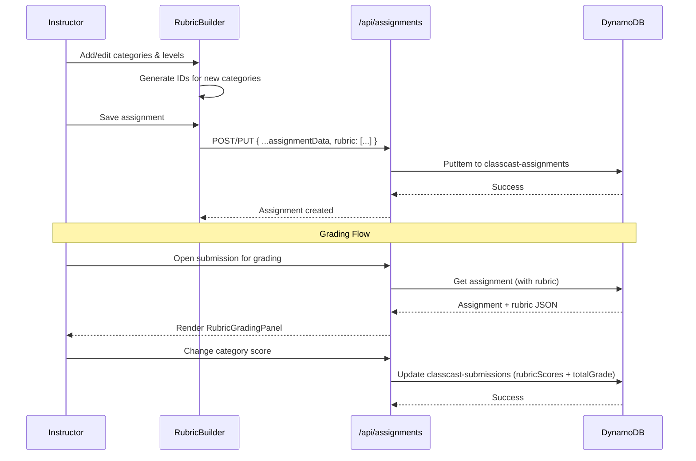

# Design Document: Instructor Creation Flow & Rubric Grading

## Overview

This design introduces four integrated features into the ClassCast instructor experience:

1. **Unified Create Modal** — A modal dialog triggered by the sidebar Create button offering quick access to create Courses, Assignments, or Modules.
2. **Rubric Builder** — A step in the assignment creation/edit flow for defining structured grading criteria with categories and scoring levels, pre-loaded with video-centric template rubrics so instructors type as little as possible.
3. **Rubric-Based Grading Panel** — A slider+input UI for grading video submissions against individual rubric categories, with auto-calculated totals and auto-save.
4. **AI Tools Landing Page** — A restyled page at `/instructor/ai` that connects to the existing AI assistant features (auto-grading, feedback generator) and surfaces upcoming AI tools with "Coming Soon" badges.

These components share state through the existing DynamoDB `classcast-assignments` table (rubric JSON stored on assignment records) and the `classcast-submissions` table (per-category scores stored alongside total grade on submission records).

### Existing Infrastructure Leveraged

- **AI Auto-Grading**: Existing `AutoGradingSystem` component + `/api/ai/auto-grade` endpoint (simulated AI scoring against rubric criteria)
- **AI Rubric Generator**: Endpoint exists at `/api/ai/rubric-generator` but returns a 402 subscription paywall — the new AI Tools page will surface this with a "Coming Soon" badge
- **AI Grading API**: `/api/ai/grading` endpoint for essay grading, `/api/ai/grade-response` for peer response grading
- **Assignment Creation Form**: `AssignmentCreationForm.tsx` already has `customRubricCategories`, `rubricType`, and color/emoji fields — these need to be properly wired and restyled
- **Class Colors**: `src/lib/class-colors.ts` defines 10 color options already — the color picker in assignment creation needs to be connected to actually persist and display colors on assignment cards
- **Grade Submission API**: `/api/submissions/[submissionId]/grade` already handles `PUT` with grade + feedback — needs extension for `rubricScores`

## Architecture

### What's Already Working vs. What Needs Work

| Component | Status | Notes |
|-----------|--------|-------|
| `AssignmentCreationForm.tsx` | ⚠️ Partially working | Form creates assignments, but: color picker doesn't render on cards, rubric section is inline (not wizard step), styling doesn't match ClassCast theme |
| `/instructor/classes/create` | ✅ Working | Course creation flow functions correctly |
| `/instructor/lesson-modules` | ✅ Working | Module management page exists and functions |
| `AutoGradingSystem` component | ✅ Working (simulated) | Mounts from AI assistant page, simulates AI scoring |
| AI Chat Assistant | ✅ Working (hardcoded responses) | Returns subject-specific assignment ideas based on keywords |
| `/api/ai/rubric-generator` | ❌ Paywall stub | Returns 402 — will be surfaced as "Coming Soon" |
| `/api/submissions/[id]/grade` | ✅ Working | Saves grade + feedback, needs extension for `rubricScores` |
| `GradingModal.tsx` | ⚠️ Partially working | Has rubric scoring UI but uses hardcoded `sampleRubric` instead of assignment's actual rubric |
| Assignment card colors | ❌ Not connected | `color` field saved to DB but cards in `AssignmentManagement.tsx` don't use it for rendering |
| Sidebar Create button | ⚠️ Routes directly | Currently routes to `/instructor/classes/create` — needs to open CreateModal instead |
| InstructorSidebar nav items | ✅ Working | All nav items route correctly, need to add "AI" nav item |

### High-Level Component Architecture

```mermaid
graph TD
    subgraph Sidebar
        A[InstructorSidebar] --> B[Create Button]
        A --> C[AI Nav Item]
    end

    B --> D[CreateModal]
    D -->|New Course| E[/instructor/classes/create]
    D -->|New Assignment| F[AssignmentCreationFlow]
    D -->|New Module| G[/instructor/lesson-modules]

    F --> H[Step 1: Course Selection]
    F --> I[Step 2: Assignment Details]
    F --> J[Step 3: RubricBuilder]
    F --> K[Step 4: Review & Save]

    J --> L[TemplateRubricSelector]
    J --> M[RubricCategoryEditor]
    M --> N[ScoringLevelEditor]

    C --> O[/instructor/ai Page]
    O --> P[AI Feature Cards]

    subgraph Grading Flow
        Q[Video Submission View] --> R{Has Rubric?}
        R -->|Yes| S[RubricGradingPanel]
        R -->|No| T[Single Number Input]
    end

    S --> U[CategoryScoreRow - slider + input]
    S --> V[TotalGradeDisplay]
    S --> W[SetAllMaxButton]
```

### Data Flow



### Page Routes

| Route | Component | Purpose |
|-------|-----------|---------|
| `/instructor/ai` | AIToolsPage | Restyled AI features page (connects existing features + Coming Soon) |
| `/instructor/assignments/create` | AssignmentCreationFlow | Multi-step assignment creation with rubric builder (no course context) |
| `/instructor/courses/[courseId]/assignments/create` | AssignmentCreationFlow | Multi-step creation with pre-selected course |
| Existing grading routes | Enhanced with RubricGradingPanel | Rubric-based grading UI |

### Theme & Styling Standards

All new and restyled components MUST follow the ClassCast design language:

| Element | Style |
|---------|-------|
| Background | White (`#FFFFFF`) |
| Primary accent | Navy (`#005587`) |
| Secondary accent / CTA | Gold (`#FFC72C`) |
| Heading font | `'Oswald', sans-serif` — uppercase, bold |
| Body font | System font stack (Inter/system-ui) |
| Card radius | `rounded-2xl` (16px) |
| Button radius | `rounded-xl` (12px) for primary, `rounded-full` for small actions |
| Card style | `bg-white shadow-sm border border-gray-100 rounded-2xl` |
| Mobile-first | All layouts start mobile, enhance at `md:` and `lg:` breakpoints |

## Components and Interfaces

### 1. CreateModal

**Location:** `src/components/instructor/CreateModal.tsx`

```typescript
interface CreateModalProps {
  isOpen: boolean;
  onClose: () => void;
}

interface CreateOption {
  id: 'course' | 'assignment' | 'module';
  label: string;
  description: string;
  icon: React.ReactNode;
  route: string;
}
```

**Behavior:**
- Renders as a centered modal overlay with backdrop click + Escape to dismiss
- Three option cards in a vertical stack (mobile) or horizontal row (desktop)
- On option select: close modal, then `router.push(route)`
- "New Assignment" routes to `/instructor/assignments/create` (course-less flow with course selection step)

### 2. RubricBuilder

**Location:** `src/components/instructor/RubricBuilder.tsx`

```typescript
interface RubricCategory {
  id: string;          // UUID generated on creation
  name: string;
  levels: ScoringLevel[];
}

interface ScoringLevel {
  score: number;
  description: string;
}

interface RubricBuilderProps {
  value: RubricCategory[];
  onChange: (rubric: RubricCategory[]) => void;
  disabled?: boolean;
}
```

**State Management:**
- Uses controlled component pattern — parent owns state via `value`/`onChange`
- Internal state for template confirmation dialog
- Generates `crypto.randomUUID()` for new category IDs
- Validates on parent save attempt (not on every keystroke)

**Validation Rules:**
- Each category must have non-empty `name` (trimmed)
- Each category must have ≥1 scoring level
- Each scoring level must have `score >= 0`
- Descriptions can be empty (optional)

### 3. TemplateRubricSelector

**Location:** `src/components/instructor/TemplateRubricSelector.tsx`

```typescript
interface TemplateRubricSelectorProps {
  onSelect: (template: RubricCategory[]) => void;
  hasExistingContent: boolean;
  onConfirmReplace: () => boolean; // Returns true if user confirms
}
```

### 4. RubricGradingPanel

**Location:** `src/components/instructor/RubricGradingPanel.tsx`

```typescript
interface RubricGradingPanelProps {
  rubric: RubricCategory[];
  submissionId: string;
  initialScores?: Record<string, number>; // categoryId -> score
  onScoresChange?: (scores: Record<string, number>, total: number) => void;
}

interface CategoryScoreRowProps {
  category: RubricCategory;
  value: number;
  maxValue: number;
  onChange: (value: number) => void;
}
```

**Behavior:**
- Renders one `CategoryScoreRow` per rubric category
- Each row has: category name, slider (0 to max), number input, max label
- Slider and input are bidirectionally synced
- Input values are clamped to `[0, categoryMax]`
- Total grade auto-calculates as sum of all category scores
- "Set All to Maximum" button sets each score to its category max
- Auto-saves via debounced PUT to `/api/submissions/[submissionId]/grade` on any score change

### 5. AIToolsPage

**Location:** `src/app/instructor/ai/page.tsx`

This replaces the existing `/instructor/ai-assistant/page.tsx` with a restyled page that:
- Connects to the **existing** `AutoGradingSystem` component (auto-grade feature is already functional)
- Connects to the **existing** AI chat assistant (assignment ideas generator already works)
- Surfaces "AI Rubric Maker" and "AI Assignment Grader" with Coming Soon badges (rubric generator API exists but is paywalled)
- Matches the ClassCast theme (navy/gold/white, Oswald headings, rounded-2xl cards)

```typescript
interface AIFeatureCard {
  id: string;
  title: string;
  description: string;
  icon: React.ReactNode;
  status: 'available' | 'coming_soon' | 'beta';
  action?: () => void;
}
```

**Cards:**
1. **"Auto-Grade Videos"** — Status: `available` — Opens existing AutoGradingSystem
2. **"Assignment Ideas AI"** — Status: `available` — Opens existing chat assistant
3. **"AI Rubric Maker"** — Status: `coming_soon` — Non-interactive (connects to existing paywall endpoint)
4. **"AI Assignment Maker"** — Status: `coming_soon` — Non-interactive placeholder
5. **"AI Assignment Grader"** — Status: `coming_soon` — Non-interactive placeholder

### 6. Assignment Creation Flow Restyling

**Location:** Enhanced `AssignmentCreationForm.tsx` (existing component, restyled)

The existing form already has most fields but needs:
1. **Multi-step wizard UI** with progress indicator (Oswald-styled step labels)
2. **Color picker fix**: Connect `CLASS_COLORS` from `class-colors.ts` — currently the color field is set but not properly saved/displayed on assignment cards
3. **Emoji picker fix**: The emoji field exists but needs visible picker UI
4. **Rubric step integration**: Move from inline rubric section to dedicated wizard step
5. **Theme alignment**: Replace gradient backgrounds with clean white + navy/gold accent pattern

**Wizard Steps (restyled):**

```
Step 1: Details (Title, Description, Type, Due Date, Points)
Step 2: Settings (Peer Responses, Sections, Late Submission)
Step 3: Rubric (RubricBuilder with templates)
Step 4: Visual Identity (Color, Emoji, Cover Photo)
Step 5: Review & Publish
```

**Color Picker Connection:**
- Display `CLASS_COLORS` as circular swatches in Step 4
- Selected color persists to `assignment.color` attribute in DynamoDB
- Assignment cards in `AssignmentManagement.tsx` use this color for the top border/accent
- Current issue: color is saved to DB but cards don't render it — needs fix in card rendering

## Data Models

### Assignment Record (classcast-assignments table)

The existing `rubric` attribute already exists (nullable). The format is preserved:

```typescript
// Rubric stored on assignment record
interface AssignmentRubric {
  rubric: RubricCategory[] | null;
}

// Full category structure
interface RubricCategory {
  id: string;          // e.g., "cat_abc123"
  name: string;        // e.g., "Mathematical Accuracy"
  levels: {
    score: number;     // e.g., 4
    description: string; // e.g., "All calculations are correct"
  }[];
}
```

### Submission Record (classcast-submissions table)

**New attributes added to submission records when rubric grading is used:**

```typescript
interface SubmissionRubricGrade {
  // Existing fields
  grade: number;              // Total grade (sum of rubric scores)
  gradedAt: string;           // ISO timestamp
  instructorFeedback: string;

  // New fields for rubric-based grading
  rubricScores: Record<string, number>;  // { [categoryId]: score }
  gradingMethod: 'rubric' | 'simple';    // Indicates how grade was assigned
}
```

**DynamoDB Update Expression for rubric grading:**
```
SET grade = :grade, rubricScores = :rubricScores, gradingMethod = :method, gradedAt = :gradedAt, updatedAt = :updatedAt
```

### Template Rubric Definitions

All templates are designed for **video assignments and lesson modules** — the primary submission type in ClassCast. Templates include the most common grading categories with pre-written level descriptions so instructors only need to tailor, not write from scratch.

```typescript
const TEMPLATE_RUBRICS: Record<string, { label: string; description: string; categories: RubricCategory[] }> = {
  video_presentation: {
    label: 'Video Presentation',
    description: 'General video assignment with content, delivery, and production quality',
    categories: [
      {
        id: 'tpl_vid_content',
        name: 'Content & Knowledge',
        levels: [
          { score: 5, description: 'Demonstrates thorough understanding with accurate, comprehensive coverage of the topic' },
          { score: 4, description: 'Shows strong understanding with minor gaps in coverage' },
          { score: 3, description: 'Adequate understanding of main concepts but lacks depth' },
          { score: 2, description: 'Limited understanding with notable inaccuracies or missing content' },
          { score: 1, description: 'Minimal relevant content or significant misunderstandings' },
          { score: 0, description: 'No relevant content presented' }
        ]
      },
      {
        id: 'tpl_vid_delivery',
        name: 'Delivery & Communication',
        levels: [
          { score: 5, description: 'Clear, confident, engaging delivery with excellent eye contact and pacing' },
          { score: 4, description: 'Clear delivery with good pacing and mostly natural presence' },
          { score: 3, description: 'Understandable delivery but reads from notes or has uneven pacing' },
          { score: 2, description: 'Difficult to follow due to mumbling, rushing, or excessive pauses' },
          { score: 1, description: 'Very difficult to understand or mostly reads a script word-for-word' },
          { score: 0, description: 'Inaudible or no verbal communication' }
        ]
      },
      {
        id: 'tpl_vid_organization',
        name: 'Organization & Structure',
        levels: [
          { score: 3, description: 'Clear introduction, logical flow, and strong conclusion' },
          { score: 2, description: 'Has structure but transitions are weak or conclusion is abrupt' },
          { score: 1, description: 'Disorganized with no clear beginning, middle, or end' },
          { score: 0, description: 'No discernible structure' }
        ]
      },
      {
        id: 'tpl_vid_production',
        name: 'Video & Audio Quality',
        levels: [
          { score: 2, description: 'Clear audio, good lighting, stable camera, appropriate framing' },
          { score: 1, description: 'Some audio or video issues but content is still understandable' },
          { score: 0, description: 'Poor quality making content difficult to engage with' }
        ]
      }
    ]
  },
  math_video_explanation: {
    label: 'Math Video Explanation',
    description: 'Video where students explain math problem-solving step by step',
    categories: [
      {
        id: 'tpl_math_accuracy',
        name: 'Mathematical Accuracy',
        levels: [
          { score: 5, description: 'All calculations correct with proper mathematical reasoning shown' },
          { score: 4, description: 'Minor computational errors that don't affect the overall approach' },
          { score: 3, description: 'Correct approach but several calculation errors' },
          { score: 2, description: 'Some correct elements but fundamental misunderstanding evident' },
          { score: 1, description: 'Mostly incorrect with major conceptual errors' },
          { score: 0, description: 'No mathematical content or entirely incorrect' }
        ]
      },
      {
        id: 'tpl_math_explanation',
        name: 'Explanation & Work Shown',
        levels: [
          { score: 5, description: 'Every step clearly explained with reasoning — a viewer could replicate the solution' },
          { score: 4, description: 'Most steps explained clearly with only minor gaps in reasoning' },
          { score: 3, description: 'Key steps shown but explanations are incomplete or skip logic' },
          { score: 2, description: 'Minimal explanation — shows answers without showing how' },
          { score: 1, description: 'Little to no explanation of process' },
          { score: 0, description: 'No work shown' }
        ]
      },
      {
        id: 'tpl_math_notation',
        name: 'Notation & Visual Clarity',
        levels: [
          { score: 3, description: 'Proper notation, neat handwriting/typing, easy to read on video' },
          { score: 2, description: 'Generally readable but some notation issues or messy writing' },
          { score: 1, description: 'Difficult to read or follow visually' },
          { score: 0, description: 'Unreadable or no visual work displayed' }
        ]
      },
      {
        id: 'tpl_math_delivery',
        name: 'Verbal Delivery',
        levels: [
          { score: 2, description: 'Clear, audible explanation at an appropriate pace' },
          { score: 1, description: 'Understandable but rushes, mumbles, or has long pauses' },
          { score: 0, description: 'Inaudible or no verbal explanation' }
        ]
      }
    ]
  },
  discussion_response: {
    label: 'Video Discussion Response',
    description: 'Student responds to a prompt or discusses a topic on camera',
    categories: [
      {
        id: 'tpl_disc_depth',
        name: 'Depth of Response',
        levels: [
          { score: 5, description: 'Thoughtful, nuanced response that goes beyond surface-level with specific examples' },
          { score: 4, description: 'Good depth with some specific examples or evidence' },
          { score: 3, description: 'Addresses the prompt adequately but stays surface-level' },
          { score: 2, description: 'Minimal engagement with the topic or overly brief' },
          { score: 1, description: 'Barely addresses the prompt' },
          { score: 0, description: 'Does not address the prompt' }
        ]
      },
      {
        id: 'tpl_disc_critical',
        name: 'Critical Thinking',
        levels: [
          { score: 4, description: 'Shows original analysis, makes connections, considers multiple perspectives' },
          { score: 3, description: 'Some analysis beyond summary, attempts to make connections' },
          { score: 2, description: 'Mostly summarizes without deeper analysis' },
          { score: 1, description: 'No analysis — only restates information' },
          { score: 0, description: 'No critical engagement' }
        ]
      },
      {
        id: 'tpl_disc_communication',
        name: 'Communication & Presence',
        levels: [
          { score: 3, description: 'Engages camera naturally, speaks clearly, good energy and confidence' },
          { score: 2, description: 'Adequate communication with minor delivery issues' },
          { score: 1, description: 'Reads from notes extensively or difficult to follow' },
          { score: 0, description: 'Inaudible or no attempt at engagement' }
        ]
      },
      {
        id: 'tpl_disc_time',
        name: 'Time & Completeness',
        levels: [
          { score: 3, description: 'Meets time requirements and fully addresses all parts of the prompt' },
          { score: 2, description: 'Close to time requirements, addresses most parts of the prompt' },
          { score: 1, description: 'Significantly under time or misses major parts of the prompt' },
          { score: 0, description: 'Does not meet minimum requirements' }
        ]
      }
    ]
  },
  lab_demonstration: {
    label: 'Lab/Demo Video',
    description: 'Student demonstrates a lab procedure, experiment, or hands-on skill',
    categories: [
      {
        id: 'tpl_lab_procedure',
        name: 'Procedure & Technique',
        levels: [
          { score: 5, description: 'Demonstrates proper technique throughout with clear, safe execution' },
          { score: 4, description: 'Good technique with minor procedural missteps' },
          { score: 3, description: 'Adequate execution but some steps skipped or done incorrectly' },
          { score: 2, description: 'Multiple procedural errors or safety concerns' },
          { score: 1, description: 'Poor technique throughout' },
          { score: 0, description: 'Does not demonstrate the procedure' }
        ]
      },
      {
        id: 'tpl_lab_explanation',
        name: 'Explanation & Understanding',
        levels: [
          { score: 5, description: 'Explains what they are doing and why at each step, demonstrating deep understanding' },
          { score: 4, description: 'Good explanations with minor gaps in reasoning' },
          { score: 3, description: 'Some explanation but mostly shows without telling why' },
          { score: 2, description: 'Minimal explanation of steps or reasoning' },
          { score: 1, description: 'No explanation — just performs actions silently' },
          { score: 0, description: 'No relevant demonstration' }
        ]
      },
      {
        id: 'tpl_lab_results',
        name: 'Results & Conclusions',
        levels: [
          { score: 3, description: 'Clearly presents results and draws appropriate conclusions' },
          { score: 2, description: 'Shows results but conclusions are weak or missing' },
          { score: 1, description: 'Results unclear or no conclusions drawn' },
          { score: 0, description: 'No results presented' }
        ]
      },
      {
        id: 'tpl_lab_video',
        name: 'Video Quality & Visibility',
        levels: [
          { score: 2, description: 'All steps clearly visible, good angles, clear audio explanations' },
          { score: 1, description: 'Some steps hard to see or hear but mostly followable' },
          { score: 0, description: 'Cannot see or follow the demonstration' }
        ]
      }
    ]
  },
  creative_project: {
    label: 'Creative Project Showcase',
    description: 'Student presents a creative work (art, music, writing, design) on video',
    categories: [
      {
        id: 'tpl_create_originality',
        name: 'Creativity & Originality',
        levels: [
          { score: 5, description: 'Highly original approach that takes creative risks and shows personal voice' },
          { score: 4, description: 'Creative approach with some original elements' },
          { score: 3, description: 'Follows the assignment but adds little personal touch' },
          { score: 2, description: 'Mostly generic with no creative effort beyond minimum' },
          { score: 1, description: 'No creative engagement' },
          { score: 0, description: 'No submission' }
        ]
      },
      {
        id: 'tpl_create_craft',
        name: 'Craftsmanship & Effort',
        levels: [
          { score: 4, description: 'Polished final product showing significant time and care invested' },
          { score: 3, description: 'Good effort evident with a mostly complete product' },
          { score: 2, description: 'Some effort but feels rushed or incomplete' },
          { score: 1, description: 'Minimal effort evident' },
          { score: 0, description: 'No meaningful product' }
        ]
      },
      {
        id: 'tpl_create_explanation',
        name: 'Artist Statement / Explanation',
        levels: [
          { score: 3, description: 'Clearly explains their creative choices, process, and inspiration' },
          { score: 2, description: 'Some explanation of choices but lacks depth' },
          { score: 1, description: 'Minimal or no explanation of creative process' },
          { score: 0, description: 'No explanation provided' }
        ]
      },
      {
        id: 'tpl_create_presentation',
        name: 'Presentation Quality',
        levels: [
          { score: 3, description: 'Work is well-presented, clearly visible/audible, and professionally showcased' },
          { score: 2, description: 'Adequate presentation with minor issues' },
          { score: 1, description: 'Poor presentation affecting ability to appreciate the work' },
          { score: 0, description: 'Cannot see/hear the work' }
        ]
      }
    ]
  }
};
```

## Correctness Properties

*A property is a characteristic or behavior that should hold true across all valid executions of a system — essentially, a formal statement about what the system should do. Properties serve as the bridge between human-readable specifications and machine-verifiable correctness guarantees.*

### Property 1: Rubric CRUD Invariant

*For any* valid rubric state with N categories, adding a category produces N+1 categories, and removing a category by ID produces N-1 categories with none of the removed category's levels remaining. Adding a level to any category increases that category's level count by 1, and removing a level decreases it by 1.

**Validates: Requirements 2.2, 2.4, 2.5, 2.6**

### Property 2: Rubric Serialization Round-Trip

*For any* valid rubric (array of categories with scoring levels), serializing it to the DynamoDB JSON format and then deserializing it back into the builder state produces a structurally equivalent rubric with identical category order, names, and scoring levels.

**Validates: Requirements 2.7, 2.8, 5.2, 5.5**

### Property 3: Rubric Validation

*For any* rubric state, validation SHALL reject the rubric if any category has an empty (whitespace-only) name, has zero scoring levels, or has any scoring level with a score below zero. Validation SHALL accept the rubric if all categories have non-empty names, at least one scoring level, and all scores are ≥ 0.

**Validates: Requirements 2.9**

### Property 4: Unique ID Generation

*For any* set of N new categories without existing IDs, the ID generation function SHALL produce N distinct non-empty string identifiers with no collisions.

**Validates: Requirements 5.3**

### Property 5: Template Application

*For any* template rubric from the predefined set, selecting that template SHALL produce a rubric state where every category name matches the template definition and every scoring level's score and description matches the template definition.

**Validates: Requirements 3.3**

### Property 6: Slider/Input Bidirectional Sync

*For any* category with maximum score M and any value V in [0, M], setting the slider to V SHALL update the number input to V, and typing V into the number input SHALL update the slider position to V.

**Validates: Requirements 4.4, 4.5**

### Property 7: Value Clamping

*For any* numeric input value V and any category maximum M (where M > 0), the resulting score SHALL be `max(0, min(V, M))`.

**Validates: Requirements 4.6**

### Property 8: Auto-Calculate Total

*For any* set of category scores `[s1, s2, ..., sN]`, the displayed total grade SHALL equal `s1 + s2 + ... + sN`.

**Validates: Requirements 4.7, 4.8**

### Property 9: Set All to Maximum

*For any* rubric with categories where each category has a maximum score (the highest score in its levels array), triggering "Set All to Maximum" SHALL set each category's current score to its respective maximum, and the total SHALL equal the sum of all maximums.

**Validates: Requirements 4.10**

### Property 10: Step Navigation Preserves Data

*For any* form data entered in any step of the Assignment_Creation_Flow, navigating forward then backward (or backward then forward) SHALL preserve all entered field values without loss.

**Validates: Requirements 7.2**

## Error Handling

### RubricBuilder Errors

| Scenario | Handling |
|----------|----------|
| Empty category name on save | Highlight field in red, show inline "Category name is required" message, prevent save |
| Category with no scoring levels | Show warning banner "Each category needs at least one scoring level", prevent save |
| Negative score value | Clamp to 0 on blur, show brief toast |
| API save failure | Show error toast "Failed to save assignment. Please try again.", preserve form state |
| Template load with existing data | Show confirmation dialog before replacing |

### RubricGradingPanel Errors

| Scenario | Handling |
|----------|----------|
| Auto-save API failure | Show non-blocking error indicator on the panel, retry on next change, queue failed save |
| Invalid score typed (NaN) | Ignore input, keep previous value |
| Rubric missing from assignment | Fall back to single-number grade input (Requirement 4.11) |
| Network offline | Show "Offline — grades will save when connection restores", queue saves |

### CreateModal Errors

| Scenario | Handling |
|----------|----------|
| Navigation failure | Log error, show toast "Navigation failed", keep modal open |

### Assignment Creation Flow Errors

| Scenario | Handling |
|----------|----------|
| Color not persisting | Fix: ensure `color` field from `CLASS_COLORS` is included in API POST body (currently defined in form state but may not serialize correctly for all code paths) |
| Emoji not displaying | Fix: ensure emoji picker selection updates formData.emoji and is included in API payload |
| Form loses data on step navigation | Use single React state object across all steps (existing pattern), ensure state is not reset on step transitions |
| Course selection required but missing | Block "Next" button on Step 1 until course is selected, show inline helper text |

## Testing Strategy

### Unit Tests (Example-Based)

- **CreateModal**: Verify 3 options render, click handlers route correctly, Escape/backdrop close
- **AI Tools Page**: Verify available features connect to existing components, Coming Soon cards are non-interactive, theme matches (navy/gold)
- **RubricBuilder**: Verify default category creation, template confirmation dialog, initial state
- **Assignment Creation Flow**: Verify multi-step navigation, required/optional step indicators, course selection step presence
- **Color Picker Integration**: Verify color selection persists to form state, renders on assignment cards
- **Existing Feature Smoke Tests**: Verify `AutoGradingSystem` still mounts, AI chat assistant responds, course creation at `/instructor/classes/create` still works

### Property-Based Tests

Property-based testing is appropriate for this feature because the core logic (rubric CRUD operations, validation, serialization, score calculations, and value clamping) involves pure functions with clear input/output behavior and wide input spaces.

**Library:** `fast-check` (already compatible with the Next.js/Jest test environment)

**Configuration:**
- Minimum 100 iterations per property test
- Each test tagged with: `Feature: instructor-creation-flow-rubric-grading, Property {N}: {title}`

**Properties to implement:**
1. Rubric CRUD Invariant — generate random rubric states, perform add/remove operations, verify counts
2. Rubric Serialization Round-Trip — generate random valid rubrics, serialize/deserialize, verify equality
3. Rubric Validation — generate both valid and invalid rubrics, verify acceptance/rejection
4. Unique ID Generation — generate batches of N, verify all distinct
5. Template Application — for each template, apply and verify structural match
6. Slider/Input Bidirectional Sync — generate random values in valid range, verify sync
7. Value Clamping — generate random values (including out-of-range), verify clamping
8. Auto-Calculate Total — generate random score arrays, verify sum
9. Set All to Maximum — generate random rubrics, trigger max, verify scores
10. Step Navigation Preserves Data — generate random form states, navigate, verify preservation

### Integration Tests

- **Rubric save to DynamoDB**: Create assignment with rubric via API, retrieve, verify schema
- **Rubric grade submission**: Submit per-category scores via API, retrieve submission, verify stored data
- **Auto-save grading**: Mock API, change scores, verify debounced save call with correct payload
- **End-to-end creation flow**: Navigate from Create Modal → Assignment Creation → Save → Verify in DB
- **Color persistence**: Create assignment with selected color, reload, verify color appears on card
- **Existing AI feature connectivity**: Verify `/api/ai/auto-grade` still responds, `AutoGradingSystem` can be opened from AI Tools page
