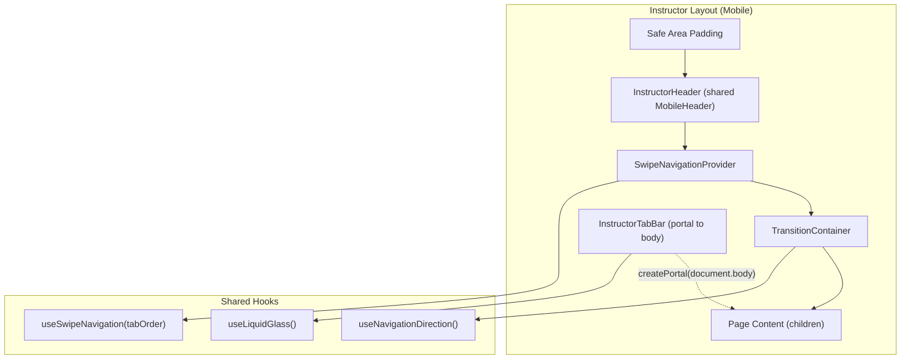
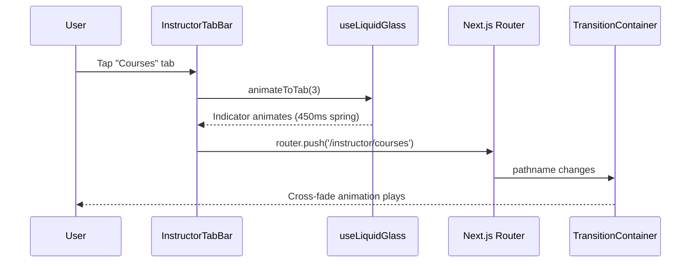
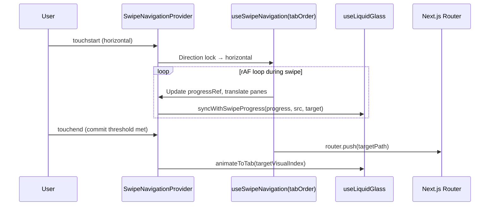
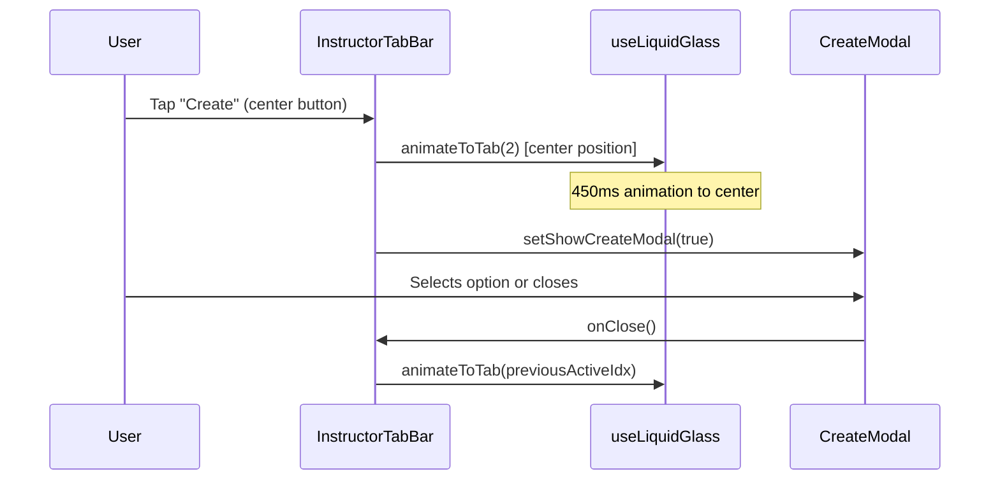

# Design Document: Instructor Mobile Portal

## Overview

The Instructor Mobile Portal brings mobile navigation parity to the instructor experience by reusing the student portal's swipe navigation, liquid glass indicator, page transitions, and branded header infrastructure. The core technical challenge is making the currently student-hardcoded `useSwipeNavigation` hook configurable, then composing a new `InstructorTabBar` component and updating the instructor layout to mirror the student layout's mobile structure.

The design favors extraction and configuration over duplication — the `useSwipeNavigation` hook gains a `tabOrder` parameter, the `useNavigationDirection` hook gains instructor tab path awareness, and a shared `MobileHeader` component replaces both `StudentHeader` and `InstructorHeader`.

## Architecture



## Sequence Diagrams

### Tab Tap Navigation



### Swipe Navigation



### Create Modal Flow



## Components and Interfaces

### Component 1: useSwipeNavigation (Refactored)

**Purpose**: Provides horizontal swipe gesture handling between adjacent tab pages. Currently hardcodes student paths — refactored to accept configurable tab order.

**Interface**:
```typescript
interface SwipeTabConfig {
  path: string;
  visualIndex: number;
}

interface UseSwipeNavigationOptions {
  tabOrder: SwipeTabConfig[];
}

interface UseSwipeNavigationReturn {
  containerRef: React.RefObject<HTMLDivElement | null>;
  currentPaneRef: React.RefObject<HTMLDivElement | null>;
  previewPaneRef: React.RefObject<HTMLDivElement | null>;
  progressRef: React.RefObject<number>;
  isSwipingRef: React.RefObject<boolean>;
  targetTabIndexRef: React.RefObject<number | null>;
  isSwipeEnabled: boolean;
}

function useSwipeNavigation(options?: UseSwipeNavigationOptions): UseSwipeNavigationReturn;
```

**Key Change**: The `SWIPE_TAB_ORDER` constant becomes the default value when no `options` are provided (backward-compatible). When `options.tabOrder` is supplied, that array drives path resolution, index lookup, and boundary detection.

**Responsibilities**:
- Accept optional `tabOrder` config; fall back to existing student tab order for backward compatibility
- Touch gesture detection with direction locking
- Progress calculation and DOM translation during swipe
- Commit/cancel decision and navigation

### Component 2: SwipeNavigationProvider (Refactored)

**Purpose**: Wraps content area with swipe gesture support and exposes swipe state via context.

**Interface**:
```typescript
interface SwipeNavigationProviderProps {
  children: React.ReactNode;
  tabOrder?: SwipeTabConfig[];
}

function SwipeNavigationProvider({ children, tabOrder }: SwipeNavigationProviderProps): JSX.Element;
```

**Key Change**: Accepts optional `tabOrder` prop and passes it to `useSwipeNavigation`. Also passes `tabOrder` to the context's `getSwipeIndexFromPath` usage.

**Responsibilities**:
- Pass `tabOrder` configuration down to the swipe hook
- Provide swipe state context to child components (indicator, tab bar)

### Component 3: InstructorTabBar

**Purpose**: Floating glass bottom navigation bar for instructor mobile pages. Mirrors StudentTabBar structure with instructor-specific tabs and Create modal integration.

**Interface**:
```typescript
interface InstructorTabBarProps {
  // No required props — reads route from usePathname()
}

function InstructorTabBar(): JSX.Element;
```

**Responsibilities**:
- Render 5 tab buttons: Dashboard, Grading, Create, Courses, Profile
- Use `createPortal` to render to `document.body` (avoids `will-change: transform` breaking `position: fixed`)
- Drive `LiquidGlassIndicator` via `useLiquidGlass` hook
- Sync indicator with swipe progress from `SwipeNavigationContext`
- Open `CreateModal` on center button tap (with indicator animation to center, then back)
- Highlight active tab with navy `#005587`
- Apply glass morphism styling matching StudentTabBar

### Component 4: InstructorHeader (or shared MobileHeader)

**Purpose**: Branded header displaying ClassCast logo and school logo. Identical to StudentHeader — can be extracted as a shared component or simply reused.

**Interface**:
```typescript
// Option A: Shared component
interface MobileHeaderProps {
  portalBasePath: string; // e.g. '/instructor' or '/student'
}

// Option B: Direct reuse — InstructorHeader is just StudentHeader re-exported
// Since StudentHeader only navigates to '/student/courses' on search click,
// the instructor version should navigate to '/instructor/courses' instead.
function InstructorHeader(): JSX.Element;
```

**Decision**: Create a thin `InstructorHeader` component that mirrors `StudentHeader` but routes search to `/instructor/courses`. Both can later be refactored into a shared `MobileHeader` if desired.

**Responsibilities**:
- Display "ClassCast" in Grand Hotel cursive, navy `#005587`
- Display ClassCast logo and school logo
- Provide search icon routing to instructor courses

### Component 5: useNavigationDirection (Extended)

**Purpose**: Classifies navigations as tab-switch, drill-in, drill-out, or swipe. Currently only knows about student tab paths.

**Interface** (unchanged externally):
```typescript
function useNavigationDirection(): TransitionState;
```

**Key Change**: The internal `TAB_PATHS` constant must include instructor tab paths so that navigation between instructor tabs is classified as `tab-switch` (cross-fade) rather than drill-in/out.

```typescript
const TAB_PATHS = [
  // Student
  '/student/dashboard',
  '/student/assignments',
  '/student/courses',
  '/student/profile',
  // Instructor
  '/instructor/dashboard',
  '/instructor/grading',
  '/instructor/courses',
  '/instructor/profile',
];
```

### Component 6: Instructor Layout (Modified)

**Purpose**: Root layout for instructor pages. On wide screens renders sidebar. On mobile, renders the full mobile shell (header + swipe provider + transitions + tab bar).

**Interface** (unchanged — it's a Next.js layout):
```typescript
function InstructorLayout({ children }: { children: React.ReactNode }): JSX.Element;
```

**Responsibilities**:
- Detect viewport via `useIsWideScreen`
- Wide: render sidebar + main content (unchanged)
- Mobile: render safe-area padding → InstructorHeader (on tab pages) → SwipeNavigationProvider (with instructor tab order) → TransitionContainer → children + InstructorTabBar

## Data Models

### Instructor Tab Configuration

```typescript
// Instructor swipeable tab order (excludes Create since it's a modal action)
const INSTRUCTOR_SWIPE_TAB_ORDER: SwipeTabConfig[] = [
  { path: '/instructor/dashboard', visualIndex: 0 },
  { path: '/instructor/grading', visualIndex: 1 },
  { path: '/instructor/courses', visualIndex: 3 },
  { path: '/instructor/profile', visualIndex: 4 },
];

// Visual index mapping for the 5-slot tab bar:
// 0 = Dashboard, 1 = Grading, 2 = Create (modal), 3 = Courses, 4 = Profile
```

### Instructor Tab Page Paths

```typescript
// Pages that show the shared header (main tab pages only)
const INSTRUCTOR_TAB_PATHS = [
  '/instructor/dashboard',
  '/instructor/grading',
  '/instructor/courses',
  '/instructor/profile',
];
```

### Swipe-to-Visual Index Mapping

```typescript
// Maps swipe order index (0-3) to visual tab bar index (0-4, skipping 2)
const INSTRUCTOR_SWIPE_TO_VISUAL = [0, 1, 3, 4];
// Dashboard=0, Grading=1, Courses=3, Profile=4
```

## Key Functions with Formal Specifications

### Function 1: useSwipeNavigation(options?)

```typescript
function useSwipeNavigation(options?: UseSwipeNavigationOptions): UseSwipeNavigationReturn
```

**Preconditions:**
- If `options.tabOrder` is provided, it must be a non-empty array of `SwipeTabConfig` objects
- Each `SwipeTabConfig.path` must be a valid route string starting with `/`
- Each `SwipeTabConfig.visualIndex` must be a non-negative integer

**Postconditions:**
- Returns refs for DOM containers and swipe state
- Swipe gestures navigate only to paths defined in the effective `tabOrder`
- When no `options` are provided, behavior is identical to the current student implementation

**Loop Invariants:** N/A

### Function 2: getSwipeIndexFromPath(pathname, tabOrder?)

```typescript
function getSwipeIndexFromPath(
  pathname: string,
  tabOrder?: SwipeTabConfig[]
): number | null
```

**Preconditions:**
- `pathname` is a non-empty string
- If `tabOrder` is provided, it is a valid SwipeTabConfig array

**Postconditions:**
- Returns the index within `tabOrder` (or default SWIPE_TAB_ORDER) matching `pathname`
- Returns `null` if `pathname` is not found in the tab order

### Function 3: classifyNavigation(prevPath, currPath, isPopState)

```typescript
function classifyNavigation(
  prevPath: string | null,
  currPath: string,
  isPopState: boolean
): NavigationDirection
```

**Preconditions:**
- `currPath` is a valid route string
- `prevPath` may be null (first navigation)

**Postconditions:**
- Returns `'tab-switch'` when both paths are in `TAB_PATHS`
- Returns `'drill-in'` when navigating to deeper route depth
- Returns `'drill-out'` when navigating to shallower depth or popstate
- Returns swipe direction if `swipeDirectionOverride` is set
- Returns `'none'` for first navigation or same-path navigation

## Algorithmic Pseudocode

### Instructor Layout Mobile Rendering

```typescript
function InstructorLayout({ children }) {
  const { isWide } = useIsWideScreen();
  const pathname = usePathname();
  const { direction, prevPath, isAnimating } = useNavigationDirection();

  if (isWide) {
    // Desktop: existing sidebar layout (unchanged)
    return (
      <div className="flex h-screen">
        <InstructorSidebar />
        <main>{children}</main>
      </div>
    );
  }

  // Mobile layout
  const isOnTabPage = INSTRUCTOR_TAB_PATHS.includes(pathname);
  const wasDrillingFromTab = direction === 'drill-in' 
    && isAnimating 
    && prevPath 
    && INSTRUCTOR_TAB_PATHS.includes(prevPath);
  const showHeader = isOnTabPage || wasDrillingFromTab;

  return (
    <div style={{ paddingTop: 'env(safe-area-inset-top, 0px)' }}>
      {showHeader && <InstructorHeader />}
      <SwipeNavigationProvider tabOrder={INSTRUCTOR_SWIPE_TAB_ORDER}>
        <TransitionContainer>
          {children}
        </TransitionContainer>
      </SwipeNavigationProvider>
      <InstructorTabBar />
    </div>
  );
}
```

### Tab Bar Active Index Resolution

```typescript
function getInstructorActiveIndex(pathname: string): number {
  // Returns visual index (0-4) for the tab bar indicator
  if (pathname === '/instructor/dashboard') return 0;
  if (pathname.startsWith('/instructor/grading')) return 1;
  if (pathname.startsWith('/instructor/courses')) return 3;
  if (pathname.startsWith('/instructor/profile')) return 4;
  return -1; // Not on a tab page
}
```

### Swipe Hook Refactoring (Key Change)

```typescript
// Before: hardcoded constant
const SWIPE_TAB_ORDER = [
  { path: '/student/dashboard', visualIndex: 0 },
  // ...
];

// After: parameter with default
function useSwipeNavigation(options?: UseSwipeNavigationOptions) {
  const effectiveTabOrder = options?.tabOrder ?? DEFAULT_STUDENT_TAB_ORDER;
  
  // All internal functions now use effectiveTabOrder instead of the constant:
  // - getSwipeIndexFromPath(pathname, effectiveTabOrder)
  // - getAdjacentTab(currentIndex, direction, effectiveTabOrder)
  // - SWIPE_TAB_ORDER[gesture.targetIndex].path → effectiveTabOrder[gesture.targetIndex].path
}
```

## Example Usage

```typescript
// In src/app/instructor/layout.tsx
import { SwipeNavigationProvider } from '@/components/transitions/SwipeNavigationProvider';
import TransitionContainer from '@/components/transitions/TransitionContainer';
import { InstructorHeader } from '@/components/instructor/InstructorHeader';
import { InstructorTabBar } from '@/components/instructor/InstructorTabBar';

const INSTRUCTOR_SWIPE_TAB_ORDER = [
  { path: '/instructor/dashboard', visualIndex: 0 },
  { path: '/instructor/grading', visualIndex: 1 },
  { path: '/instructor/courses', visualIndex: 3 },
  { path: '/instructor/profile', visualIndex: 4 },
];

export default function InstructorLayout({ children }) {
  const { isWide } = useIsWideScreen();
  // ... mobile rendering with SwipeNavigationProvider tabOrder={INSTRUCTOR_SWIPE_TAB_ORDER}
}
```

```typescript
// In InstructorTabBar — syncing indicator with swipe progress
useEffect(() => {
  if (!swipeContext) return;
  const { progressRef, isSwipingRef, targetTabIndexRef } = swipeContext;
  const SWIPE_TO_VISUAL = [0, 1, 3, 4];

  const tick = () => {
    if (isSwipingRef.current && targetTabIndexRef.current !== null) {
      const sourceVisual = activeIdx;
      const targetVisual = SWIPE_TO_VISUAL[targetTabIndexRef.current] ?? activeIdx;
      syncWithSwipeProgress(progressRef.current, sourceVisual, targetVisual);
    }
    rafId = requestAnimationFrame(tick);
  };
  let rafId = requestAnimationFrame(tick);
  return () => cancelAnimationFrame(rafId);
}, [swipeContext, activeIdx, syncWithSwipeProgress]);
```

## Error Handling

### Error Scenario 1: Swipe on Non-Tab Page

**Condition**: Instructor navigates to a sub-route (e.g., `/instructor/courses/123`) and attempts to swipe.
**Response**: `getSwipeIndexFromPath` returns `null`, `isSwipeEnabled` is `false`, touch handlers do not activate.
**Recovery**: No recovery needed — gestures are simply ignored on non-swipeable pages.

### Error Scenario 2: Portal Mount Before DOM Ready

**Condition**: `InstructorTabBar` renders before `document.body` is available (SSR).
**Response**: The `mounted` state guard (`useState(false)` + `useEffect → true`) prevents `createPortal` from executing during SSR.
**Recovery**: Portal renders on first client-side paint after hydration.

### Error Scenario 3: Tab Order Mismatch

**Condition**: A developer passes a `tabOrder` to `SwipeNavigationProvider` that doesn't match the actual routes.
**Response**: `getSwipeIndexFromPath` returns `null`, disabling swipe on that page.
**Recovery**: Developer corrects the `tabOrder` config to match actual route paths.

## Testing Strategy

### Unit Testing Approach

- Test `getSwipeIndexFromPath` with custom tab orders to verify correct index resolution
- Test `getAdjacentTab` boundary conditions with different-length tab arrays
- Test `classifyNavigation` with instructor tab paths to ensure correct direction classification
- Test `getInstructorActiveIndex` returns correct visual index for all instructor paths

### Property-Based Testing Approach

**Property Test Library**: fast-check

- Generate random tab orders and verify swipe index lookup is always within bounds or null
- Generate random pathname strings and verify `classifyNavigation` always returns a valid `NavigationDirection`

### Integration Testing Approach

- Mount `InstructorLayout` in mobile viewport and verify header, swipe provider, transition container, and tab bar all render
- Simulate tab tap and verify `router.push` is called with correct instructor path
- Verify `createPortal` renders tab bar outside the transform container

## Performance Considerations

- `InstructorTabBar` uses `createPortal` to `document.body` to avoid `position: fixed` being broken by ancestor `will-change: transform` properties
- Swipe progress updates use `requestAnimationFrame` loop with direct DOM manipulation — no React re-renders during gesture
- `LiquidGlassIndicator` position is driven via `style.left` and `style.transform` rather than React state to avoid reconciliation overhead
- The `useLiquidGlass` hook is shared without modification — no additional memory overhead

## Security Considerations

- No new API endpoints or data flows introduced
- All navigation is client-side route changes within the existing Next.js app
- The `CreateModal` routes to existing instructor pages that already have auth guards

## Dependencies

- **Existing**: `useLiquidGlass`, `LiquidGlassIndicator`, `SwipeNavigationProvider`, `TransitionContainer`, `useNavigationDirection`, `useIsWideScreen`, `CreateModal`, `ModalTransition`
- **Modified**: `useSwipeNavigation` (add `options` parameter), `useNavigationDirection` (extend `TAB_PATHS`), `SwipeNavigationProvider` (add `tabOrder` prop)
- **New Components**: `InstructorTabBar`, `InstructorHeader`
- **No new third-party dependencies**

## Correctness Properties

*A property is a characteristic or behavior that should hold true across all valid executions of a system — essentially, a formal statement about what the system should do. Properties serve as the bridge between human-readable specifications and machine-verifiable correctness guarantees.*

### Property 1: Swipe index lookup consistency

*For any* valid `tabOrder` array and any pathname that exists in that array, `getSwipeIndexFromPath(pathname, tabOrder)` SHALL return the correct index, and for any pathname not in the array, it SHALL return `null`.

**Validates: Requirements 3.2, 7.3**

### Property 2: Adjacent tab boundary safety

*For any* tab order of length N, `getAdjacentTab(0, 'right')` SHALL return `null` (left boundary) and `getAdjacentTab(N-1, 'left')` SHALL return `null` (right boundary), ensuring swipe never navigates beyond the defined tab range.

**Validates: Requirements 3.5, 3.6**

### Property 3: Navigation direction classification correctness

*For any* two paths that are both in the extended `TAB_PATHS` array (including instructor paths), `classifyNavigation(prevPath, currPath, false)` SHALL return `'tab-switch'`, ensuring instructor tab navigation produces cross-fade animations rather than drill transitions.

**Validates: Requirements 6.1, 6.2, 6.3**

### Property 4: Visual index mapping round-trip

*For any* instructor tab path, the visual index returned by `getInstructorActiveIndex(path)` SHALL match the `visualIndex` field in the corresponding `INSTRUCTOR_SWIPE_TAB_ORDER` entry, ensuring the tab bar indicator and swipe system agree on tab positions.

**Validates: Requirements 2.1, 2.3**

### Property 5: Backward-compatible default behavior

*For any* call to `useSwipeNavigation()` without options, the effective tab order SHALL equal the original student tab order constant, ensuring no regression in the student portal.

**Validates: Requirements 7.3, 7.4**
