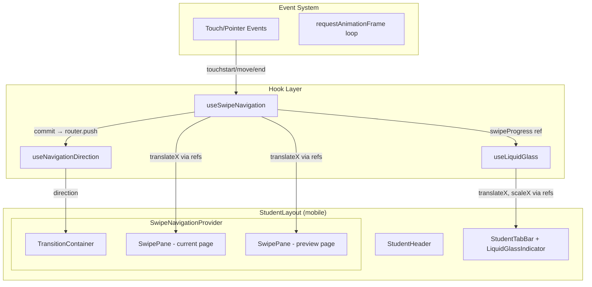
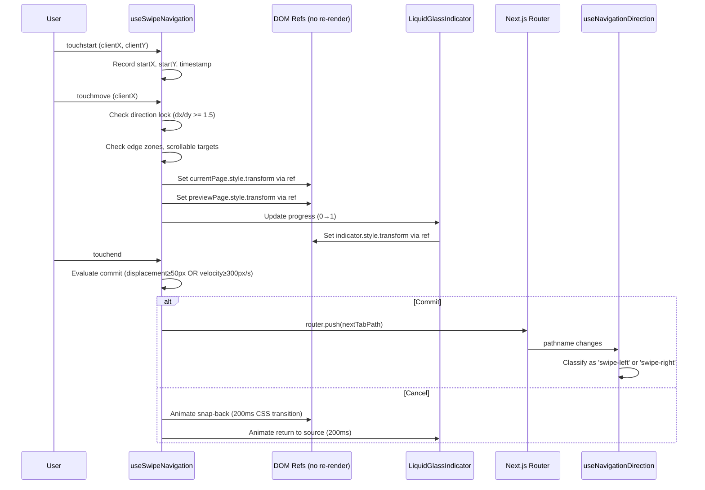

# Technical Design Document: Swipe Navigation with Liquid Glass

## Overview

This feature adds horizontal swipe gesture navigation between tab pages and a liquid glass morphing indicator to ClassCast's student mobile experience. It builds on the existing `useNavigationDirection` hook and `TransitionContainer` without replacing them — instead extending the direction taxonomy with `swipe-left`/`swipe-right` values and adding a new `useSwipeNavigation` hook that drives both page translation and indicator interpolation during gestures.

All animation is CSS-transform-only, executed via direct DOM manipulation through refs during active gestures to maintain 60 fps in WKWebView without React re-renders.

## Architecture

### System Architecture Diagram



### Data Flow During Swipe Gesture



### Component Hierarchy

```
src/
├── app/student/layout.tsx                          ← Wraps content in SwipeNavigationProvider
├── hooks/
│   ├── useNavigationDirection.ts                   ← MODIFIED: adds 'swipe-left'|'swipe-right' directions
│   ├── useSwipeNavigation.ts                       ← NEW: gesture detection, commit/cancel logic
│   └── useLiquidGlass.ts                           ← NEW: indicator position/morph interpolation
├── components/
│   ├── transitions/
│   │   ├── TransitionContainer.tsx                 ← MODIFIED: adds swipe slide animation classes
│   │   └── SwipeNavigationProvider.tsx             ← NEW: context + swipe panes + event binding
│   └── student/
│       ├── StudentTabBar.tsx                       ← MODIFIED: uses LiquidGlassIndicator
│       └── LiquidGlassIndicator.tsx                ← NEW: animated glass pill element
└── app/globals.css                                 ← MODIFIED: adds swipe + liquid glass CSS
```

## Components and Interfaces

### useSwipeNavigation Hook

The core gesture engine. Uses refs exclusively for position tracking during active gestures to avoid React re-renders.

```typescript
interface SwipeConfig {
  displacementThreshold: number;  // 50px
  velocityThreshold: number;      // 300px/s
  directionLockRatio: number;     // 1.5
  dampingThreshold: number;       // 0.8 (of screen width)
  dampingFactor: number;          // 0.5
  edgeZone: number;               // 20px
  cancelDuration: number;         // 200ms
}

interface SwipeState {
  isActive: boolean;
  direction: 'left' | 'right' | null;
  progress: number;               // 0 to 1
  currentTabIndex: number;
  targetTabIndex: number | null;
}

interface UseSwipeNavigationReturn {
  /** Ref to attach to the swipeable content container */
  containerRef: RefObject<HTMLDivElement>;
  /** Ref to the current page pane for direct DOM manipulation */
  currentPaneRef: RefObject<HTMLDivElement>;
  /** Ref to the preview page pane */
  previewPaneRef: RefObject<HTMLDivElement>;
  /** Current swipe progress (0-1), updated via ref for indicator sync */
  progressRef: RefObject<number>;
  /** Whether a swipe is currently active */
  isSwipingRef: RefObject<boolean>;
  /** The target tab index during active swipe (null if none) */
  targetTabIndexRef: RefObject<number | null>;
  /** Whether the current page is a swipeable tab page */
  isSwipeEnabled: boolean;
}
```

### useLiquidGlass Hook

Drives the indicator's position and morph animation in sync with swipe progress.

```typescript
interface UseLiquidGlassReturn {
  /** Ref to attach to the indicator DOM element */
  indicatorRef: RefObject<HTMLDivElement>;
  /** Trigger animated transition to a new tab (for tap navigation) */
  animateToTab: (targetIndex: number) => void;
  /** Update indicator position during swipe (called from rAF loop) */
  syncWithSwipeProgress: (progress: number, sourceIdx: number, targetIdx: number) => void;
  /** Snap indicator back to source tab (cancel) */
  snapBack: (sourceIdx: number) => void;
}
```

### LiquidGlassIndicator Component

```typescript
interface LiquidGlassIndicatorProps {
  activeIndex: number;            // Current active tab (0-4 including Post position)
  /** Ref forwarded from useLiquidGlass for direct DOM manipulation */
  indicatorRef: RefObject<HTMLDivElement>;
}
```

### SwipeNavigationProvider Component

```typescript
interface SwipeNavigationContextValue {
  progressRef: RefObject<number>;
  isSwipingRef: RefObject<boolean>;
  targetTabIndexRef: RefObject<number | null>;
  currentTabIndex: number;
}
```

### Extended NavigationDirection Type

```typescript
// Modified from existing
type NavigationDirection = 
  | 'tab-switch' 
  | 'drill-in' 
  | 'drill-out' 
  | 'swipe-left'    // NEW: swipe toward next tab
  | 'swipe-right'   // NEW: swipe toward previous tab
  | 'none';
```

## Data Models

### Tab Order Mapping

```typescript
/** 
 * Maps swipe-navigable tab indices to their routes and visual positions.
 * Post button (visual index 2) is excluded from swipe navigation.
 */
const SWIPE_TAB_ORDER = [
  { path: '/student/dashboard',   visualIndex: 0, label: 'Home' },
  { path: '/student/assignments', visualIndex: 1, label: 'Assignments' },
  { path: '/student/courses',     visualIndex: 3, label: 'Courses' },
  { path: '/student/profile',     visualIndex: 4, label: 'Profile' },
] as const;

type SwipeTabIndex = 0 | 1 | 2 | 3;  // Index within SWIPE_TAB_ORDER
```

### Gesture State (Internal to Hook)

```typescript
interface GestureState {
  startX: number;
  startY: number;
  startTime: number;
  currentX: number;
  directionLocked: boolean;
  isHorizontal: boolean | null;  // null = undecided
  isActive: boolean;
}
```

### Indicator Animation State

```typescript
interface IndicatorState {
  sourcePosition: number;       // CSS left % of source tab
  targetPosition: number;       // CSS left % of target tab
  progress: number;             // 0 to 1
  morphPhase: 'stretch' | 'compress' | 'settle' | 'idle';
}
```

## Detailed Design

### 1. Gesture Detection Algorithm (useSwipeNavigation)

```typescript
function computeCommitDecision(gesture: GestureState, config: SwipeConfig): 'commit' | 'cancel' {
  const displacement = Math.abs(gesture.currentX - gesture.startX);
  const elapsed = Date.now() - gesture.startTime;
  const velocity = displacement / (elapsed / 1000); // px/s

  if (displacement >= config.displacementThreshold) return 'commit';
  if (velocity >= config.velocityThreshold) return 'commit';
  return 'cancel';
}

function computeTranslation(
  deltaX: number, 
  screenWidth: number, 
  config: SwipeConfig
): number {
  const threshold = screenWidth * config.dampingThreshold;
  const absDelta = Math.abs(deltaX);
  
  if (absDelta <= threshold) return deltaX;
  
  // Apply damping beyond threshold
  const sign = deltaX > 0 ? 1 : -1;
  const excess = absDelta - threshold;
  return sign * (threshold + excess * config.dampingFactor);
}

function shouldIgnoreGesture(
  startX: number, 
  screenWidth: number, 
  target: HTMLElement,
  event: TouchEvent
): boolean {
  // Edge exclusion zone
  if (startX < 20 || startX > screenWidth - 20) return true;
  
  // defaultPrevented by child
  if (event.defaultPrevented) return true;
  
  // Target or ancestor is horizontally scrollable
  if (isHorizontallyScrollable(target)) return true;
  
  return false;
}

function isHorizontallyScrollable(element: HTMLElement): boolean {
  let el: HTMLElement | null = element;
  while (el) {
    if (el.scrollWidth > el.clientWidth) {
      const overflow = getComputedStyle(el).overflowX;
      if (overflow === 'auto' || overflow === 'scroll') return true;
    }
    el = el.parentElement;
  }
  return false;
}
```

### 2. Direction Lock Algorithm

```typescript
function checkDirectionLock(
  dx: number, 
  dy: number, 
  ratio: number
): 'horizontal' | 'vertical' | 'undecided' {
  const absDx = Math.abs(dx);
  const absDy = Math.abs(dy);
  
  // Need minimum movement to decide (10px)
  if (absDx < 10 && absDy < 10) return 'undecided';
  
  if (absDx >= absDy * ratio) return 'horizontal';
  if (absDy >= absDx * ratio) return 'vertical';
  
  return 'undecided';
}
```

### 3. Tab Navigation Logic

```typescript
function getAdjacentTab(
  currentSwipeIndex: SwipeTabIndex, 
  direction: 'left' | 'right'
): SwipeTabIndex | null {
  if (direction === 'left') {
    // Swipe left = go to next tab
    return currentSwipeIndex < 3 ? (currentSwipeIndex + 1) as SwipeTabIndex : null;
  } else {
    // Swipe right = go to previous tab
    return currentSwipeIndex > 0 ? (currentSwipeIndex - 1) as SwipeTabIndex : null;
  }
}

function getSwipeIndexFromPath(pathname: string): SwipeTabIndex | null {
  const idx = SWIPE_TAB_ORDER.findIndex(t => t.path === pathname);
  return idx >= 0 ? idx as SwipeTabIndex : null;
}

function isTabPage(pathname: string): boolean {
  return SWIPE_TAB_ORDER.some(t => t.path === pathname);
}
```

### 4. Liquid Glass Indicator Position Interpolation

```typescript
function computeIndicatorPosition(
  sourceVisualIndex: number,
  targetVisualIndex: number,
  progress: number
): { left: string; scaleX: number } {
  const sourceLeft = sourceVisualIndex * 20; // Each tab is 20% width
  const targetLeft = targetVisualIndex * 20;
  
  // Linear interpolation for position
  const currentLeft = sourceLeft + (targetLeft - sourceLeft) * progress;
  
  // Morph: stretch in first half, compress in second half
  const morphProgress = progress <= 0.5 
    ? progress * 2          // 0→1 during first half
    : (1 - progress) * 2;  // 1→0 during second half
  
  // ScaleX ranges from 1.0 to ~1.4 at peak stretch
  const scaleX = 1 + morphProgress * 0.4;
  
  return { left: `${currentLeft}%`, scaleX };
}

function computeSpringSettle(t: number): number {
  // Damped spring approximation for overshoot + settle
  // t goes from 0 to 1 over the settle duration
  const overshoot = 1.03;
  if (t < 0.7) {
    return 1 + (overshoot - 1) * Math.sin(t / 0.7 * Math.PI);
  }
  // Settle back from overshoot to 1.0
  const settleT = (t - 0.7) / 0.3;
  return overshoot - (overshoot - 1) * settleT;
}
```

### 5. CSS Definitions

```css
/* Swipe page transitions — applied by TransitionContainer */
@keyframes swipeLeftEnter {
  from { transform: translateX(100%); }
  to { transform: translateX(0); }
}
@keyframes swipeLeftExit {
  from { transform: translateX(0); }
  to { transform: translateX(-100%); }
}
@keyframes swipeRightEnter {
  from { transform: translateX(-100%); }
  to { transform: translateX(0); }
}
@keyframes swipeRightExit {
  from { transform: translateX(0); }
  to { transform: translateX(100%); }
}

.animate-swipe-left-enter {
  animation: swipeLeftEnter 300ms cubic-bezier(0.2, 0.9, 0.3, 1) both;
}
.animate-swipe-right-enter {
  animation: swipeRightEnter 300ms cubic-bezier(0.2, 0.9, 0.3, 1) both;
}

/* Liquid Glass Indicator base styling */
.liquid-glass-indicator {
  position: absolute;
  top: 0;
  bottom: 0;
  width: 20%;
  border-radius: 0.75rem; /* rounded-xl */
  background: rgba(255, 255, 255, 0.35);
  backdrop-filter: blur(8px);
  -webkit-backdrop-filter: blur(8px);
  border: 1px solid rgba(255, 255, 255, 0.4);
  box-shadow: 
    0 2px 12px rgba(0, 85, 135, 0.1),
    inset 0 1px 0 rgba(255, 255, 255, 0.5);
  /* GPU layer promotion */
  will-change: transform;
  transform: translateZ(0);
}

/* Animated transition for tap navigation (not during swipe) */
.liquid-glass-indicator--animating {
  transition: transform 450ms cubic-bezier(0.175, 0.885, 0.32, 1.275);
}

/* Snap-back transition for cancelled swipes */
.liquid-glass-indicator--snapping {
  transition: transform 200ms cubic-bezier(0.2, 0.9, 0.3, 1);
}

/* Reduced motion override */
@media (prefers-reduced-motion: reduce) {
  .liquid-glass-indicator--animating,
  .liquid-glass-indicator--snapping {
    transition: none !important;
  }
  .animate-swipe-left-enter,
  .animate-swipe-right-enter {
    animation: none !important;
  }
}

/* Swipe content area — prevents browser from consuming horizontal touches */
.swipe-content-area {
  touch-action: pan-y;
}

/* During active swipe, both panes are absolutely positioned */
.swipe-pane {
  position: absolute;
  inset: 0;
  will-change: transform;
  transform: translateZ(0);
}

.swipe-pane--current {
  z-index: 1;
}

.swipe-pane--preview {
  z-index: 0;
}
```

### 6. Integration with Existing TransitionContainer

The existing `TransitionContainer` uses `key={pathname}` to remount on route change. For swipe-initiated navigation, the flow is:

1. During gesture: `useSwipeNavigation` directly manipulates `currentPaneRef` and `previewPaneRef` transforms — no React state updates.
2. On commit: `router.push(targetPath)` triggers pathname change → `useNavigationDirection` classifies as `swipe-left` or `swipe-right`.
3. `TransitionContainer` sees the new direction and applies `animate-swipe-left-enter` or `animate-swipe-right-enter` class to the new page content.
4. The swipe pane overlay is removed once the TransitionContainer's animation starts.

Modified `ANIMATION_CLASS_MAP`:
```typescript
const ANIMATION_CLASS_MAP: Record<string, string> = {
  'tab-switch': 'animate-tab-enter',
  'drill-in': 'animate-drill-in-enter',
  'drill-out': 'animate-drill-out-enter',
  'swipe-left': 'animate-swipe-left-enter',
  'swipe-right': 'animate-swipe-right-enter',
  'none': '',
};
```

### 7. Integration with StudentTabBar

The `StudentTabBar` replaces its current static indicator `<div>` with the `<LiquidGlassIndicator>` component. The indicator receives:
- `activeIndex`: from the existing `getActiveIndex()` logic
- `indicatorRef`: from `useLiquidGlass` hook (provides direct DOM access for swipe sync)

During swipe, the `SwipeNavigationProvider` context shares `progressRef` with the tab bar. The `useLiquidGlass` hook reads this ref in a rAF loop and updates the indicator's transform directly.

### 8. SwipeNavigationProvider Architecture

```typescript
// Wraps the content area in student layout
function SwipeNavigationProvider({ children }: { children: React.ReactNode }) {
  const pathname = usePathname();
  const router = useRouter();
  const { progressRef, isSwipingRef, targetTabIndexRef, containerRef, currentPaneRef, previewPaneRef } = useSwipeNavigation();
  
  const swipeIndex = getSwipeIndexFromPath(pathname);
  const isEnabled = swipeIndex !== null;
  
  return (
    <SwipeNavigationContext.Provider value={{ progressRef, isSwipingRef, targetTabIndexRef, currentTabIndex: swipeIndex ?? 0 }}>
      <div ref={containerRef} className="relative flex-1 min-h-0 overflow-hidden swipe-content-area">
        {/* Current page content */}
        <div ref={currentPaneRef} className="swipe-pane swipe-pane--current">
          {children}
        </div>
        {/* Preview pane — rendered offscreen, positioned by swipe engine */}
        <div ref={previewPaneRef} className="swipe-pane swipe-pane--preview" style={{ transform: 'translateX(100%)' }}>
          {/* Placeholder content or cached page snapshot */}
        </div>
      </div>
    </SwipeNavigationContext.Provider>
  );
}
```

### 9. Rubber-Band Effect at Boundaries

When the user is on Dashboard and swipes right, or on Profile and swipes left:

```typescript
function computeRubberBand(deltaX: number, screenWidth: number): number {
  // Strong damping — feels like hitting a wall with elasticity
  const maxStretch = screenWidth * 0.15; // Max 15% of screen
  const resistance = 0.3;
  const dampedDelta = deltaX * resistance;
  
  // Clamp to max stretch
  return Math.sign(dampedDelta) * Math.min(Math.abs(dampedDelta), maxStretch);
}
```

### 10. Preview Page Strategy

For the swipe preview, we have two viable approaches:

**Approach A (Chosen): Screenshot/Cached Render**
- When a tab page mounts, render it to a container and cache the outerHTML.
- During swipe, inject the cached HTML into the preview pane as a static snapshot.
- This avoids mounting full React component trees during gestures.
- Trade-off: preview may be slightly stale.

**Approach B: Live Render**
- Mount the target page component in the preview pane.
- More accurate but risks jank from React rendering during gesture.

We use **Approach A** for performance. The 200-300ms between swipe commit and route change is short enough that stale content is imperceptible.

## Correctness Properties

*A property is a characteristic or behavior that should hold true across all valid executions of a system — essentially, a formal statement about what the system should do. Properties serve as the bridge between human-readable specifications and machine-verifiable correctness guarantees.*

### Property 1: Swipe Commit Decision

*For any* horizontal gesture with displacement ≥ 50px OR velocity ≥ 300px/s, the swipe engine SHALL commit the navigation. *For any* gesture with displacement < 50px AND velocity < 300px/s, the swipe engine SHALL cancel the navigation.

**Validates: Requirements 1.1, 1.2, 1.3, 1.4**

### Property 2: Translation Proportionality with Damping

*For any* touch deltaX during an active swipe, the computed page translation SHALL equal deltaX when |deltaX| ≤ 80% of screen width, and SHALL equal `threshold + (|deltaX| - threshold) * 0.5` (preserving sign) when |deltaX| > 80% of screen width.

**Validates: Requirements 1.5, 3.1, 3.4**

### Property 3: Direction Lock Classification

*For any* pair of displacement values (dx, dy) where at least one exceeds 10px, the direction lock SHALL classify as 'horizontal' if and only if |dx| ≥ |dy| × 1.5, and as 'vertical' if and only if |dy| ≥ |dx| × 1.5.

**Validates: Requirements 1.6**

### Property 4: Tab Order Navigation

*For any* current swipe tab index and swipe direction, `getAdjacentTab` SHALL return the correct next/previous index within the sequence [Dashboard(0), Assignments(1), Courses(2), Profile(3)], or null when at a boundary. The Post button position SHALL never appear in results.

**Validates: Requirements 2.1, 2.2, 2.3, 2.4**

### Property 5: Route Classification

*For any* pathname string, `isTabPage` SHALL return true if and only if the pathname exactly matches one of the four Tab_Page paths (/student/dashboard, /student/assignments, /student/courses, /student/profile).

**Validates: Requirements 2.5, 2.6**

### Property 6: Preview Page Position

*For any* swipe progress value p ∈ [0, 1] and swipe direction, the preview pane's translateX SHALL equal `(1 - p) * 100%` in the direction of entry (from right for swipe-left, from left for swipe-right).

**Validates: Requirements 3.2**

### Property 7: Indicator Position Interpolation

*For any* source visual index, target visual index, and progress value p ∈ [0, 1], the indicator's computed left position SHALL equal `sourceLeft + (targetLeft - sourceLeft) * p` where each position is `index * 20%`.

**Validates: Requirements 4.2**

### Property 8: Indicator Morph Curve

*For any* progress value p ∈ [0, 1], the indicator's scaleX SHALL be `1 + morphProgress * 0.4` where morphProgress = `p * 2` when p ≤ 0.5, and `(1 - p) * 2` when p > 0.5. The scaleX SHALL always be ≥ 1.0 and ≤ 1.4.

**Validates: Requirements 5.2**

### Property 9: Edge Zone Exclusion

*For any* touch start event with clientX < 20 or clientX > screenWidth - 20, the swipe engine SHALL not initiate a swipe gesture.

**Validates: Requirements 9.2**

### Property 10: Scrollable Element Detection

*For any* touch event whose target (or any ancestor up to the swipe container) has scrollWidth > clientWidth and overflowX of 'auto' or 'scroll', the swipe engine SHALL not initiate a swipe gesture.

**Validates: Requirements 9.1**

## Error Handling

| Scenario | Handling |
|----------|----------|
| Router.push fails during commit | Snap both panes and indicator back to source position. Log error silently. |
| Touch events fire during route transition | Ignore touches while `isAnimating` is true from useNavigationDirection. |
| Preview content unavailable (cache miss) | Show empty pane with background color matching theme — content loads on route change. |
| Rapid successive swipes | Queue is single-depth: new swipe attempt during existing animation is ignored. |
| Component unmounts during gesture | Cleanup via useEffect return — remove event listeners, cancel rAF. |
| Invalid pathname (not in tab order) | `getSwipeIndexFromPath` returns null → swipe disabled for that page. |
| prefers-reduced-motion enabled | All animations instant (CSS media query), morph/spring effects skipped. |

## Testing Strategy

### Property-Based Tests (fast-check)

The feature's core logic — gesture math, commit decisions, tab navigation, indicator interpolation — is pure functions with well-defined input/output behavior. Property-based testing is ideal here.

- **Library**: `fast-check` (already available in JS/TS ecosystem)
- **Minimum iterations**: 100 per property
- **Tag format**: `Feature: swipe-navigation-liquid-glass, Property {N}: {title}`

Each correctness property above maps to a single property-based test file:
- `useSwipeNavigation.property.test.ts` — Properties 1-6, 9, 10
- `useLiquidGlass.property.test.ts` — Properties 7, 8

### Unit Tests (example-based)

- Cancel animation snap-back applies correct CSS transition duration (200ms)
- Reduced motion media query disables all animations
- `useNavigationDirection` returns 'swipe-left'/'swipe-right' for swipe-initiated navigation
- Tab tap still produces 'tab-switch' direction
- Rubber-band effect clamps to 15% of screen width

### Integration Tests

- Full swipe gesture → route change → indicator settles at correct tab
- Swipe disabled on sub-pages (e.g., /student/assignments/123)
- Horizontally scrollable child element takes priority over swipe
- Tab bar tap navigation unaffected by swipe engine presence
- TransitionContainer applies correct animation class for swipe vs tap

### Performance Validation

- Manual device testing on iPhone 12+ in WKWebView
- Chrome DevTools Performance panel: verify no layout/paint during gesture (only composite)
- React Profiler: verify zero re-renders during active swipe gesture
