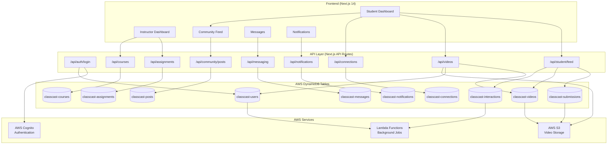

# ClassCast Backend Infrastructure & Data Flow

## System Architecture Diagram



## Detailed Data Flow

### 1. Authentication Flow
```
User Login
  ↓
/api/auth/login
  ↓
Cognito Authentication
  ↓
User Data from DynamoDB (classcast-users)
  ↓
JWT Token Generation
  ↓
Frontend State (AuthContext)
```

### 2. Student Feed Flow
```
Student Dashboard Request
  ↓
/api/student/feed?userId={id}
  ↓
Fetch from multiple tables:
  - classcast-submissions (videos)
  - classcast-posts (community)
  - classcast-assignments
  - classcast-interactions (likes/comments)
  ↓
Enrich with user data (classcast-users)
  ↓
Combine and sort by timestamp
  ↓
Return unified feed
```

### 3. Video Submission Flow
```
User Uploads Video
  ↓
/api/video-submissions or /api/videos/upload
  ↓
Get S3 Presigned URL
  ↓
Upload to S3
  ↓
Save metadata to:
  - classcast-submissions
  - classcast-videos
  ↓
Create interaction record
```

### 4. Social Features Flow

#### Study Buddy Connections
```
Click "Connect" Button
  ↓
/api/connections POST
  ↓
Save to classcast-connections
  {
    connectionId: "user1_user2",
    requesterId: user1,
    requestedId: user2,
    status: "accepted"
  }
  ↓
Update frontend state
```

#### Comments
```
Submit Comment
  ↓
/api/videos/{videoId}/interactions POST
  {
    type: "comment",
    userId, userName, userAvatar,
    content
  }
  ↓
Save to classcast-interactions
  ↓
Update interaction count
```

#### Likes
```
Like/Unlike Video
  ↓
/api/videos/{videoId}/like POST
  ↓
Update classcast-interactions
  ↓
Return updated count
```

### 5. Messaging Flow
```
Send Message
  ↓
/api/messaging/messages POST
  ↓
Save to classcast-messages
  {
    fromUserId,
    toUserId,
    content,
    timestamp
  }
  ↓
Real-time update (WebSocket or polling)
```

### 6. Notification Flow
```
Event Occurs (like, comment, grade)
  ↓
Lambda Function or API Endpoint
  ↓
Create in classcast-notifications
  ↓
/api/notifications returns to frontend
  ↓
Display in notification bell
```

## Database Schema Overview

### classcast-users
- userId (Primary Key)
- email, firstName, lastName
- avatar, role
- Study Buddy connections
- profile data

### classcast-submissions
- submissionId (Primary Key)
- studentId, assignmentId
- videoUrl (S3 reference)
- timestamp, status

### classcast-videos
- videoId (Primary Key)
- userId, assignmentId
- title, description
- viewCount, likeCount
- videoUrl (S3)

### classcast-connections
- connectionId (Primary Key)
- requesterId, requestedId
- status: pending/accepted
- createdAt, updatedAt

### classcast-posts
- postId (Primary Key)
- userId, courseId
- content, title
- timestamp
- likeCount, commentCount

### classcast-messages
- messageId (Primary Key)
- fromUserId, toUserId
- content
- timestamp, read status

### classcast-interactions
- interactionId (Primary Key)
- videoId (GSI)
- userId (GSI)
- type: like/comment/response
- content, timestamp

### classcast-notifications
- notificationId (Primary Key)
- userId
- type, title, message
- read status, timestamp

### classcast-assignments
- assignmentId (Primary Key)
- courseId
- title, description
- dueDate, status

### classcast-courses
- courseId (Primary Key)
- name, code
- instructorId
- enrolled students

## API Endpoint Categories

### Authentication
- `POST /api/auth/login` - User login
- `POST /api/auth/signup` - User registration
- `GET /api/auth/me` - Get current user
- `POST /api/auth/logout` - Logout

### User Management
- `GET /api/profile?userId={id}` - Get user profile
- `POST /api/profile/update` - Update profile
- `GET /api/users` - List users

### Feed & Content
- `GET /api/student/feed?userId={id}` - Get student feed
- `GET /api/videos` - Get videos
- `POST /api/video-submissions` - Upload video
- `GET /api/community/posts` - Get community posts
- `POST /api/community/posts` - Create post

### Social Features
- `GET /api/connections?userId={id}` - Get connections
- `POST /api/connections` - Create connection
- `POST /api/videos/{id}/like` - Like/unlike
- `POST /api/videos/{id}/interactions` - Comment/respond

### Messaging
- `GET /api/messaging/conversations?userId={id}`
- `GET /api/messaging/messages?userId1={id}&userId2={id}`
- `POST /api/messaging/messages`

### Notifications
- `GET /api/notifications?userId={id}`
- `POST /api/notifications/{id}/read`
- `POST /api/notifications/create`

## Technology Stack

- **Frontend**: Next.js 14 (React), TypeScript, Tailwind CSS
- **Backend**: Next.js API Routes
- **Database**: AWS DynamoDB
- **Storage**: AWS S3
- **Authentication**: AWS Cognito
- **Hosting**: AWS Amplify / Vercel
- **Real-time**: WebSockets (optional)

## Data Security

- JWT token-based authentication
- AWS Cognito for user management
- S3 presigned URLs for secure uploads
- DynamoDB encryption at rest
- Role-based access control (student/instructor/admin)

