# ClassCast Platform - Infrastructure & Build Design

## System Architecture Overview

```mermaid
graph TB
    subgraph "Client Layer"
        WEB[Web Browser]
        MOBILE[Mobile Browser]
    end

    subgraph "CDN & Edge"
        CF[CloudFront CDN]
        EDGE[Edge Locations]
    end

    subgraph "Frontend - Next.js 14"
        NEXTJS[Next.js Application]
        SSR[Server-Side Rendering]
        API_ROUTES[API Routes]
        MIDDLEWARE[Middleware]
        
        subgraph "Pages & Components"
            STUDENT[Student Dashboard]
            INSTRUCTOR[Instructor Dashboard]
            ADMIN[Admin Panel]
            AUTH_UI[Auth UI]
        end
    end

    subgraph "API Gateway Layer"
        APIGW[API Gateway REST]
        APIGW_WS[API Gateway WebSocket]
        CORS[CORS Configuration]
    end

    subgraph "Authentication & Authorization"
        COGNITO[Amazon Cognito]
        USER_POOL[User Pool]
        ID_POOL[Identity Pool]
        
        subgraph "Cognito Triggers"
            PRE_AUTH[PreAuthentication]
            POST_CONF[PostConfirmation]
            PRE_TOKEN[PreTokenGeneration]
            CUSTOM_MSG[CustomMessage]
        end
    end

    subgraph "Compute Layer - AWS Lambda"
        subgraph "Auth Functions"
            L_SIGNUP[Signup Handler]
            L_SIGNIN[Signin Handler]
            L_VERIFY[Email Verification]
            L_RESET[Password Reset]
            L_SESSION[Session Management]
            L_JWT[JWT Verifier]
        end

        subgraph "Business Logic"
            L_ASSIGN[Assignment Management]
            L_GRADE[Grading System]
            L_SUBMIT[Submission Handler]
            L_FEED[Community Feed]
        end

        subgraph "Video Processing"
            L_UPLOAD[Video Upload URL]
            L_PROCESS[Video Processing]
            L_TRANSCODE[Video Transcoding]
        end

        subgraph "AI & Moderation"
            L_AI_GRADE[AI Essay Grader]
            L_AI_TUTOR[AI Tutoring]
            L_MODERATE[Content Moderation]
            L_COMMENT[Comment Moderation]
        end

        subgraph "Monitoring"
            L_ERROR[Error Aggregation]
            L_PERF[Performance Analyzer]
            L_NOTIFY[Notification Handler]
        end
    end

    subgraph "Data Layer"
        subgraph "DynamoDB Tables"
            DB_USERS[(Users Table)]
            DB_COURSES[(Courses Table)]
            DB_ASSIGN[(Assignments Table)]
            DB_SUBMIT[(Submissions Table)]
            DB_GRADES[(Grades Table)]
            DB_VIDEOS[(Videos Table)]
            DB_COMMENTS[(Comments Table)]
            DB_RESPONSES[(Responses Table)]
            DB_NOTIFY[(Notifications Table)]
            DB_SECTIONS[(Sections Table)]
            DB_ENROLL[(Enrollments Table)]
            DB_CONNECT[(Connections Table)]
        end
    end

    subgraph "Storage Layer"
        subgraph "S3 Buckets"
            S3_VIDEO[Video Storage Bucket]
            S3_DOCS[Documents Bucket]
            S3_ASSETS[Assets Bucket]
            S3_BACKUP[Backup Bucket]
        end
    end

    subgraph "Messaging & Notifications"
        SNS_ERROR[Error Tracking Topic]
        SNS_PERF[Performance Topic]
        SNS_NOTIFY[Notifications Topic]
        SNS_GRADE[Grading Topic]
    end

    subgraph "Monitoring & Logging"
        CW_LOGS[CloudWatch Logs]
        CW_METRICS[CloudWatch Metrics]
        CW_ALARMS[CloudWatch Alarms]
        CW_DASH_ERROR[Error Dashboard]
        CW_DASH_PERF[Performance Dashboard]
    end

    subgraph "Security & IAM"
        IAM_ROLES[IAM Roles]
        STUDENT_ROLE[Student Role]
        INSTRUCTOR_ROLE[Instructor Role]
        ADMIN_ROLE[Admin Role]
        LAMBDA_ROLE[Lambda Execution Role]
    end

    subgraph "Infrastructure as Code"
        CDK[AWS CDK]
        
        subgraph "CDK Stacks"
            STACK_AUTH[Auth Stack]
            STACK_DB[Database Stack]
            STACK_STORAGE[Storage Stack]
            STACK_API[API Gateway Stack]
            STACK_VIDEO[Video Interactions]
            STACK_ERROR[Error Tracking]
            STACK_LOG[Logging Stack]
            STACK_MONITOR[Monitoring Stack]
        end
    end

    %% Client to Frontend
    WEB --> CF
    MOBILE --> CF
    CF --> EDGE
    EDGE --> NEXTJS

    %% Frontend Internal
    NEXTJS --> SSR
    NEXTJS --> API_ROUTES
    NEXTJS --> MIDDLEWARE
    SSR --> STUDENT
    SSR --> INSTRUCTOR
    SSR --> ADMIN
    API_ROUTES --> AUTH_UI

    %% Frontend to API Gateway
    API_ROUTES --> APIGW
    API_ROUTES --> APIGW_WS
    APIGW --> CORS

    %% API Gateway to Auth
    APIGW --> COGNITO
    COGNITO --> USER_POOL
    COGNITO --> ID_POOL
    USER_POOL --> PRE_AUTH
    USER_POOL --> POST_CONF
    USER_POOL --> PRE_TOKEN
    USER_POOL --> CUSTOM_MSG

    %% API Gateway to Lambda
    APIGW --> L_SIGNUP
    APIGW --> L_SIGNIN
    APIGW --> L_VERIFY
    APIGW --> L_ASSIGN
    APIGW --> L_GRADE
    APIGW --> L_SUBMIT
    APIGW --> L_UPLOAD
    APIGW --> L_MODERATE

    %% Lambda to Database
    L_SIGNUP --> DB_USERS
    L_SIGNIN --> DB_USERS
    L_ASSIGN --> DB_ASSIGN
    L_GRADE --> DB_GRADES
    L_SUBMIT --> DB_SUBMIT
    L_FEED --> DB_COURSES
    L_PROCESS --> DB_VIDEOS
    L_COMMENT --> DB_COMMENTS
    POST_CONF --> DB_USERS
    PRE_AUTH --> DB_USERS

    %% Lambda to Storage
    L_UPLOAD --> S3_VIDEO
    L_PROCESS --> S3_VIDEO
    L_ASSIGN --> S3_DOCS
    L_MODERATE --> S3_VIDEO

    %% Lambda to Messaging
    L_ERROR --> SNS_ERROR
    L_PERF --> SNS_PERF
    L_NOTIFY --> SNS_NOTIFY
    L_GRADE --> SNS_GRADE

    %% Monitoring
    L_ERROR --> CW_LOGS
    L_PERF --> CW_LOGS
    CW_LOGS --> CW_METRICS
    CW_METRICS --> CW_ALARMS
    CW_METRICS --> CW_DASH_ERROR
    CW_METRICS --> CW_DASH_PERF

    %% Security
    COGNITO --> IAM_ROLES
    IAM_ROLES --> STUDENT_ROLE
    IAM_ROLES --> INSTRUCTOR_ROLE
    IAM_ROLES --> ADMIN_ROLE
    IAM_ROLES --> LAMBDA_ROLE

    %% CDK Infrastructure
    CDK --> STACK_AUTH
    CDK --> STACK_DB
    CDK --> STACK_STORAGE
    CDK --> STACK_API
    
    STACK_AUTH -.-> COGNITO
    STACK_AUTH -.-> IAM_ROLES
    STACK_DB -.-> DB_USERS
    STACK_STORAGE -.-> S3_VIDEO
    STACK_API -.-> APIGW
    STACK_VIDEO -.-> L_PROCESS
    STACK_ERROR -.-> L_ERROR
    STACK_LOG -.-> CW_LOGS
    STACK_MONITOR -.-> CW_METRICS

    style WEB fill:#4A90E2
    style MOBILE fill:#4A90E2
    style NEXTJS fill:#000000,color:#fff
    style COGNITO fill:#DD344C
    style APIGW fill:#FF9900
    style DB_USERS fill:#4053D6
    style S3_VIDEO fill:#569A31
    style CDK fill:#FF9900
```



## Detailed Component Breakdown

### 1. Frontend Architecture (Next.js 14)

```
┌─────────────────────────────────────────────────────────┐
│                   Next.js Application                    │
├─────────────────────────────────────────────────────────┤
│                                                           │
│  ┌──────────────┐  ┌──────────────┐  ┌──────────────┐  │
│  │   App Router │  │  API Routes  │  │  Middleware  │  │
│  └──────────────┘  └──────────────┘  └──────────────┘  │
│                                                           │
│  Student Features:                                        │
│  • Dashboard (Real-time updates)                         │
│  • Video Submission (WebRTC, Mobile support)            │
│  • Assignment Management                                  │
│  • Peer Reviews                                           │
│  • Community Feed                                         │
│  • Notifications                                          │
│                                                           │
│  Instructor Features:                                     │
│  • Course Management                                      │
│  • Bulk Grading Interface                                │
│  • Student Progress Analytics                            │
│  • Assignment Creation (Rich Text, File Upload)         │
│  • Video Review & Feedback                               │
│  • Section Management                                     │
│                                                           │
│  Admin Features:                                          │
│  • User Management                                        │
│  • System Monitoring                                      │
│  • Error Reporting Dashboard                             │
│  • Content Moderation                                     │
│                                                           │
└─────────────────────────────────────────────────────────┘
```

### 2. Lambda Functions Architecture (30+ Functions)

```
┌─────────────────────────────────────────────────────────────────┐
│                      AWS Lambda Functions                        │
├─────────────────────────────────────────────────────────────────┤
│                                                                   │
│  Authentication Layer (10 functions)                             │
│  ├─ classcast-signup-handler                                     │
│  ├─ classcast-signin-handler                                     │
│  ├─ classcast-verify-email                                       │
│  ├─ classcast-resend-verification                               │
│  ├─ classcast-forgot-password-handler                           │
│  ├─ classcast-confirm-password-reset                            │
│  ├─ classcast-refresh-token-handler                             │
│  ├─ classcast-session-management                                │
│  ├─ classcast-jwt-verifier                                       │
│  └─ classcast-role-management                                    │
│                                                                   │
│  Business Logic Layer (8 functions)                              │
│  ├─ classcast-create-assignment                                 │
│  ├─ classcast-fetch-assignments                                 │
│  ├─ classcast-grade-submission                                  │
│  ├─ classcast-fetch-grades                                      │
│  ├─ classcast-fetch-submissions                                 │
│  ├─ classcast-instructor-community-feed                         │
│  ├─ classcast-role-based-signup                                 │
│  └─ classcast-signout-handler                                    │
│                                                                   │
│  Video Processing Layer (3 functions)                            │
│  ├─ classcast-generate-video-upload-url                         │
│  ├─ classcast-process-video-submission                          │
│  └─ ClassCastVideoProcessing                                     │
│                                                                   │
│  AI & Content Moderation (3 functions)                           │
│  ├─ classcast-ai-essay-grader                                   │
│  ├─ classcast-ai-tutoring-assistant                             │
│  └─ classcast-content-moderation                                │
│                                                                   │
│  Cognito Triggers (4 functions)                                  │
│  ├─ PreTokenGenerationLambda                                    │
│  ├─ PostConfirmationLambda                                      │
│  ├─ PreAuthenticationLambda                                     │
│  └─ CustomMessageLambda                                          │
│                                                                   │
│  Monitoring & Notifications (4 functions)                        │
│  ├─ ErrorAggregationLambda                                      │
│  ├─ PerformanceAnalyzerLambda                                   │
│  ├─ CommentModerationLambda                                     │
│  └─ GradingNotificationLambda                                   │
│                                                                   │
└─────────────────────────────────────────────────────────────────┘
```

### 3. Database Schema (DynamoDB)

```
┌──────────────────────────────────────────────────────────────┐
│                    DynamoDB Tables (12)                       │
├──────────────────────────────────────────────────────────────┤
│                                                                │
│  Users Table                                                   │
│  PK: userId                                                    │
│  Attributes: email, role, firstName, lastName, department     │
│  GSI: email-index, role-index                                 │
│                                                                │
│  Courses Table                                                 │
│  PK: courseId                                                  │
│  SK: createdAt                                                 │
│  GSI: instructorId-index                                      │
│                                                                │
│  Assignments Table                                             │
│  PK: assignmentId                                              │
│  SK: courseId                                                  │
│  GSI: courseId-dueDate-index, instructorId-index             │
│                                                                │
│  Submissions Table                                             │
│  PK: submissionId                                              │
│  SK: assignmentId                                              │
│  GSI: studentId-index, assignmentId-status-index             │
│                                                                │
│  Grades Table                                                  │
│  PK: gradeId                                                   │
│  SK: submissionId                                              │
│  GSI: studentId-index, courseId-index                         │
│                                                                │
│  ClassCastVideos Table                                         │
│  PK: videoId                                                   │
│  SK: createdAt                                                 │
│  GSI: userId-index, assignmentId-index                        │
│                                                                │
│  ClassCastComments Table                                       │
│  PK: videoId                                                   │
│  SK: commentId                                                 │
│  GSI: userId-index, parentCommentId-index                     │
│                                                                │
│  ClassCastResponses Table                                      │
│  PK: videoId                                                   │
│  SK: responseId                                                │
│  GSI: userId-index, assignmentId-index, status-index         │
│                                                                │
│  ClassCastShares Table                                         │
│  PK: videoId                                                   │
│  SK: shareId                                                   │
│  GSI: userId-index                                             │
│                                                                │
│  Notifications Table                                           │
│  PK: userId                                                    │
│  SK: notificationId                                            │
│  GSI: type-index, createdAt-index                             │
│                                                                │
│  Sections Table                                                │
│  PK: sectionId                                                 │
│  SK: courseId                                                  │
│  GSI: courseId-index                                           │
│                                                                │
│  Connections Table (WebSocket)                                 │
│  PK: connectionId                                              │
│  Attributes: userId, connectedAt                              │
│                                                                │
└──────────────────────────────────────────────────────────────┘
```

### 4. Storage Architecture (S3)

```
┌─────────────────────────────────────────────────────────────┐
│                    S3 Storage Buckets                        │
├─────────────────────────────────────────────────────────────┤
│                                                               │
│  classcast-videos-{account}-{region}/                        │
│  ├─ students/                                                │
│  │  └─ {userId}/                                             │
│  │     └─ {videoId}.mp4                                      │
│  ├─ instructors/                                             │
│  │  └─ {userId}/                                             │
│  │     └─ {videoId}.mp4                                      │
│  └─ processed/                                               │
│     └─ {videoId}/                                            │
│        ├─ 720p.mp4                                           │
│        ├─ 480p.mp4                                           │
│        └─ thumbnail.jpg                                      │
│                                                               │
│  demoproject-storage-{account}-{region}/                     │
│  ├─ public/                                                  │
│  │  ├─ logos/                                                │
│  │  ├─ images/                                               │
│  │  └─ assets/                                               │
│  ├─ courses/                                                 │
│  │  └─ {courseId}/                                           │
│  │     ├─ files/                                             │
│  │     └─ resources/                                         │
│  ├─ assignments/                                             │
│  │  └─ {assignmentId}/                                       │
│  │     ├─ files/                                             │
│  │     └─ links/                                             │
│  └─ submissions/                                             │
│     └─ {submissionId}/                                       │
│        └─ attachments/                                       │
│                                                               │
│  Lifecycle Policies:                                         │
│  • Standard → IA: 30 days                                    │
│  • IA → Glacier: 90 days                                     │
│  • Versioning: Enabled                                       │
│  • Encryption: S3-Managed (SSE-S3)                          │
│                                                               │
└─────────────────────────────────────────────────────────────┘
```

### 5. Authentication Flow

```
┌─────────────────────────────────────────────────────────────────┐
│              Cognito Authentication Architecture                 │
├─────────────────────────────────────────────────────────────────┤
│                                                                   │
│  User Pool: DemoProject-UserPool                                │
│  ├─ Sign-up Flow                                                 │
│  │  1. User submits registration                               │
│  │  2. CustomMessage trigger (welcome email)                   │
│  │  3. Email verification required                             │
│  │  4. PostConfirmation trigger                                │
│  │     ├─ Add user to group (students/instructors)            │
│  │     ├─ Create DynamoDB profile                             │
│  │     └─ Send welcome notification                           │
│  │                                                               │
│  ├─ Sign-in Flow                                                 │
│  │  1. User submits credentials                                │
│  │  2. PreAuthentication trigger                               │
│  │     ├─ Check account status (locked/suspended)             │
│  │     └─ Update last login timestamp                         │
│  │  3. PreTokenGeneration trigger                              │
│  │     ├─ Add custom claims (role, userId, groups)           │
│  │     └─ Add permissions based on role                       │
│  │  4. Return tokens (ID, Access, Refresh)                    │
│  │                                                               │
│  ├─ Token Management                                             │
│  │  • ID Token: 1 hour                                          │
│  │  • Access Token: 1 hour                                      │
│  │  • Refresh Token: 30 days                                    │
│  │  • Token revocation: Enabled                                │
│  │                                                               │
│  └─ User Groups & Roles                                          │
│     ├─ students (precedence: 1)                                 │
│     │  └─ StudentRole IAM                                       │
│     ├─ instructors (precedence: 2)                              │
│     │  └─ InstructorRole IAM                                    │
│     └─ admins (precedence: 3)                                   │
│        └─ AdminRole IAM                                         │
│                                                                   │
│  Identity Pool: DemoProject-IdentityPool                        │
│  └─ Provides temporary AWS credentials for:                     │
│     ├─ S3 access (scoped by role)                              │
│     ├─ DynamoDB access (scoped by role)                        │
│     └─ API Gateway invocation                                   │
│                                                                   │
└─────────────────────────────────────────────────────────────────┘
```

### 6. Monitoring & Logging Architecture

```
┌─────────────────────────────────────────────────────────────────┐
│           CloudWatch Monitoring & Logging Stack                  │
├─────────────────────────────────────────────────────────────────┤
│                                                                   │
│  Log Groups                                                       │
│  ├─ /aws/lambda/classcast-*                                     │
│  ├─ /aws/apigateway/classcast-api                              │
│  ├─ /classcast/errors                                           │
│  └─ /classcast/performance                                      │
│                                                                   │
│  Custom Metrics                                                   │
│  ├─ DemoProject/Errors                                          │
│  │  ├─ ErrorCount (by type, severity, endpoint)               │
│  │  └─ ErrorRate                                                │
│  ├─ DemoProject/Performance                                     │
│  │  ├─ ResponseTime (by endpoint, p50/p95/p99)                │
│  │  ├─ RequestCount                                             │
│  │  ├─ RequestSize                                              │
│  │  └─ ResponseSize                                             │
│  └─ DemoProject/Business                                        │
│     ├─ UserActivityCount                                        │
│     ├─ AssignmentSubmissionCount                               │
│     └─ GradingOperationCount                                    │
│                                                                   │
│  CloudWatch Alarms                                               │
│  ├─ HighErrorRate (> 5 errors/min in prod)                     │
│  ├─ CriticalError (any critical error)                         │
│  ├─ HighResponseTime (p95 > 3s in prod)                        │
│  ├─ LowRequestCount (< 10 req/5min)                            │
│  ├─ Lambda Errors (any function error)                         │
│  └─ Database Throttling                                         │
│                                                                   │
│  CloudWatch Dashboards                                           │
│  ├─ DemoProject-Errors-{env}                                   │
│  │  ├─ Error rate by type                                      │
│  │  ├─ Error count by severity                                 │
│  │  └─ Errors by endpoint                                      │
│  └─ DemoProject-Performance-{env}                              │
│     ├─ Response time by endpoint                               │
│     ├─ Request count by endpoint                               │
│     └─ Request/Response size trends                            │
│                                                                   │
│  SNS Topics                                                       │
│  ├─ ErrorTrackingTopic                                          │
│  ├─ PerformanceMonitoringTopic                                  │
│  ├─ CriticalAlertsTopic                                         │
│  └─ NotificationsTopic                                          │
│                                                                   │
└─────────────────────────────────────────────────────────────────┘
```

### 7. CDK Infrastructure Stacks

```
┌─────────────────────────────────────────────────────────────────┐
│              AWS CDK Infrastructure as Code                      │
├─────────────────────────────────────────────────────────────────┤
│                                                                   │
│  cdk/                                                             │
│  ├─ bin/                                                         │
│  │  └─ cdk.ts (Entry point)                                     │
│  │                                                               │
│  └─ lib/                                                         │
│     ├─ auth-stack.ts                                            │
│     │  ├─ Cognito User Pool                                     │
│     │  ├─ Cognito Identity Pool                                 │
│     │  ├─ Lambda Triggers (4)                                   │
│     │  ├─ IAM Roles (Student, Instructor, Admin)              │
│     │  └─ User Pool Groups                                      │
│     │                                                             │
│     ├─ database-stack.ts                                        │
│     │  ├─ DynamoDB Tables (12)                                 │
│     │  ├─ Global Secondary Indexes                             │
│     │  ├─ Point-in-Time Recovery                               │
│     │  └─ Encryption at Rest                                    │
│     │                                                             │
│     ├─ storage-stack.ts                                         │
│     │  ├─ S3 Buckets (Video, Documents, Assets)               │
│     │  ├─ Lifecycle Policies                                    │
│     │  ├─ CORS Configuration                                    │
│     │  └─ Bucket Policies                                       │
│     │                                                             │
│     ├─ api-gateway-stack.ts                                     │
│     │  ├─ REST API Gateway                                      │
│     │  ├─ WebSocket API Gateway                                 │
│     │  ├─ API Resources & Methods                              │
│     │  ├─ Lambda Integrations                                   │
│     │  └─ CORS & Authorization                                  │
│     │                                                             │
│     ├─ video-interactions-stack.ts                              │
│     │  ├─ Video Tables                                          │
│     │  ├─ Video Processing Lambda                              │
│     │  ├─ Comment Moderation Lambda                            │
│     │  └─ Notification Lambda                                   │
│     │                                                             │
│     ├─ error-tracking-stack.ts                                  │
│     │  ├─ Error Aggregation Lambda                             │
│     │  ├─ Performance Analyzer Lambda                          │
│     │  ├─ CloudWatch Dashboards                                │
│     │  └─ SNS Topics                                            │
│     │                                                             │
│     ├─ logging-stack.ts                                         │
│     │  ├─ Central Log Group                                     │
│     │  ├─ Log Retention Policies                               │
│     │  └─ Log Metric Filters                                    │
│     │                                                             │
│     └─ monitoring-stack.ts                                      │
│        ├─ CloudWatch Alarms                                     │
│        ├─ SNS Alert Topics                                      │
│        └─ Composite Alarms                                      │
│                                                                   │
│  Deployment Commands:                                            │
│  • cdk synth      → Generate CloudFormation                     │
│  • cdk diff       → Preview changes                             │
│  • cdk deploy     → Deploy all stacks                           │
│  • cdk destroy    → Tear down infrastructure                    │
│                                                                   │
└─────────────────────────────────────────────────────────────────┘
```

## Data Flow Diagrams

### Video Submission Flow

```
Student Browser
      │
      ├─1─→ Request Upload URL
      │     (POST /api/videos/presigned-upload)
      │
      ├─2←─ Receive Presigned URL
      │     (S3 presigned URL, 15min expiry)
      │
      ├─3─→ Upload Video to S3
      │     (Direct upload, no server)
      │
      ├─4─→ Confirm Upload
      │     (POST /api/videos/confirm)
      │     │
      │     ├─→ Lambda: process-video-submission
      │     │   │
      │     │   ├─→ Update DynamoDB (Videos table)
      │     │   ├─→ Trigger transcoding (if needed)
      │     │   └─→ Create notification
      │     │
      │     └─→ SNS: Video processed notification
      │
      └─5←─ Success Response
            (Video metadata, videoId)
```

### Assignment Grading Flow

```
Instructor Dashboard
      │
      ├─1─→ Fetch Submissions
      │     (GET /api/instructor/video-submissions)
      │     │
      │     └─→ Lambda: fetch-submissions
      │         │
      │         ├─→ Query DynamoDB (Submissions table)
      │         └─→ Join with Users, Assignments
      │
      ├─2←─ Display Submissions List
      │
      ├─3─→ Submit Grade
      │     (POST /api/submissions/{id}/grade)
      │     │
      │     └─→ Lambda: grade-submission
      │         │
      │         ├─→ Update DynamoDB (Grades table)
      │         ├─→ Update Submission status
      │         ├─→ Create notification
      │         └─→ SNS: Grade notification
      │
      └─4←─ Grade Confirmation
```

### Authentication Flow

```
User Login
      │
      ├─1─→ Submit Credentials
      │     (POST /api/auth/signin)
      │
      ├─2─→ Cognito: InitiateAuth
      │     │
      │     ├─→ PreAuthentication Trigger
      │     │   └─→ Verify account status
      │     │
      │     └─→ PreTokenGeneration Trigger
      │         └─→ Add custom claims
      │
      ├─3←─ Receive Tokens
      │     (ID Token, Access Token, Refresh Token)
      │
      ├─4─→ API Request with Token
      │     (Authorization: Bearer {token})
      │     │
      │     ├─→ API Gateway Authorizer
      │     │   └─→ Verify JWT
      │     │
      │     └─→ Lambda Function
      │         └─→ Access based on role
      │
      └─5←─ Protected Resource
```

## Security Architecture

```
┌─────────────────────────────────────────────────────────────┐
│                    Security Layers                           │
├─────────────────────────────────────────────────────────────┤
│                                                               │
│  Network Security                                            │
│  ├─ CloudFront with HTTPS only                              │
│  ├─ API Gateway with TLS 1.2+                               │
│  └─ VPC (if using RDS/private resources)                    │
│                                                               │
│  Authentication & Authorization                              │
│  ├─ Cognito MFA (Optional)                                  │
│  ├─ JWT Token Validation                                    │
│  ├─ Role-Based Access Control (RBAC)                        │
│  └─ Session Management                                       │
│                                                               │
│  Data Protection                                             │
│  ├─ S3 Encryption at Rest (SSE-S3)                          │
│  ├─ DynamoDB Encryption (AWS-Managed)                       │
│  ├─ Secrets Manager for API keys                            │
│  └─ Parameter Store for config                              │
│                                                               │
│  IAM Policies                                                │
│  ├─ Least Privilege Access                                  │
│  ├─ Resource-Based Policies                                 │
│  ├─ Condition-Based Access                                  │
│  └─ Service-to-Service Authentication                        │
│                                                               │
│  Content Security                                            │
│  ├─ Content Moderation Lambda                               │
│  ├─ Input Validation                                         │
│  ├─ XSS Protection                                           │
│  └─ CORS Configuration                                       │
│                                                               │
│  Monitoring & Auditing                                       │
│  ├─ CloudTrail (API logging)                                │
│  ├─ CloudWatch Logs                                          │
│  ├─ Security Alarms                                          │
│  └─ Error Tracking                                           │
│                                                               │
└─────────────────────────────────────────────────────────────┘
```

## Deployment Pipeline

```
┌─────────────────────────────────────────────────────────────┐
│                    CI/CD Pipeline                            │
├─────────────────────────────────────────────────────────────┤
│                                                               │
│  Local Development                                           │
│  ├─ npm run dev (Next.js dev server)                        │
│  ├─ AWS CDK local synthesis                                 │
│  └─ Local testing with mock data                            │
│                                                               │
│  Version Control (Git)                                       │
│  ├─ Feature branches                                         │
│  ├─ Pull request reviews                                     │
│  └─ Main branch (protected)                                  │
│                                                               │
│  Build Process                                               │
│  ├─ npm install                                              │
│  ├─ npm run build (Next.js)                                 │
│  ├─ TypeScript compilation                                  │
│  ├─ ESLint checks                                            │
│  └─ CDK synth                                                │
│                                                               │
│  Testing                                                      │
│  ├─ Unit tests (Jest)                                        │
│  ├─ Integration tests                                        │
│  ├─ E2E tests (Playwright)                                  │
│  └─ Lambda function tests                                    │
│                                                               │
│  Deployment                                                   │
│  ├─ CDK Deploy (Infrastructure)                             │
│  │  ├─ Auth Stack                                            │
│  │  ├─ Database Stack                                        │
│  │  ├─ Storage Stack                                         │
│  │  ├─ API Gateway Stack                                     │
│  │  └─ Lambda Functions                                      │
│  │                                                             │
│  ├─ Vercel Deploy (Frontend)                                │
│  │  └─ Environment variables from AWS                        │
│  │                                                             │
│  └─ Post-Deployment                                          │
│     ├─ Smoke tests                                           │
│     ├─ Health checks                                         │
│     └─ Rollback if needed                                    │
│                                                               │
│  Monitoring                                                   │
│  ├─ Deployment metrics                                       │
│  ├─ Error rate monitoring                                    │
│  └─ Performance tracking                                     │
│                                                               │
└─────────────────────────────────────────────────────────────┘
```

## Technology Stack Summary

| Layer | Technology | Purpose |
|-------|-----------|---------|
| **Frontend** | Next.js 14 (App Router) | React framework with SSR |
| | TypeScript | Type-safe development |
| | Tailwind CSS | Styling framework |
| | React Query | Data fetching & caching |
| **Backend** | AWS Lambda | Serverless compute |
| | Node.js 18.x | Runtime environment |
| | API Gateway | REST & WebSocket APIs |
| **Authentication** | Amazon Cognito | User management & auth |
| | JWT | Token-based auth |
| **Database** | DynamoDB | NoSQL database (12 tables) |
| **Storage** | Amazon S3 | Object storage |
| **CDN** | CloudFront | Content delivery |
| **Monitoring** | CloudWatch | Logs, metrics, alarms |
| | SNS | Notifications |
| **IaC** | AWS CDK | Infrastructure as code |
| **AI/ML** | (External APIs) | Essay grading, tutoring |
| **Security** | IAM | Access management |
| | KMS | Encryption keys |

## Key Features & Capabilities

✅ **Scalability**: Serverless architecture auto-scales with demand
✅ **High Availability**: Multi-AZ deployment, 99.99% uptime SLA
✅ **Security**: End-to-end encryption, RBAC, MFA support
✅ **Performance**: CDN distribution, optimized queries, caching
✅ **Monitoring**: Real-time dashboards, automated alerts
✅ **Cost Optimization**: Pay-per-use model, lifecycle policies
✅ **Developer Experience**: TypeScript, IaC, automated deployments

## Cost Estimates (Monthly - Development)

| Service | Estimated Cost |
|---------|---------------|
| Lambda (30+ functions) | $5-20 |
| DynamoDB (12 tables) | $10-30 |
| S3 Storage | $5-15 |
| API Gateway | $3-10 |
| Cognito | $0-5 (free tier) |
| CloudWatch | $5-10 |
| Data Transfer | $5-10 |
| **Total** | **$33-100/month** |

## Production Considerations

- [ ] Enable CloudFront caching
- [ ] Configure backup retention
- [ ] Set up disaster recovery
- [ ] Implement rate limiting
- [ ] Add WAF rules
- [ ] Configure auto-scaling policies
- [ ] Set up cross-region replication
- [ ] Implement blue-green deployments
- [ ] Add performance testing
- [ ] Configure cost alerts

---

**Last Updated**: November 13, 2024
**Version**: 2.0
**Maintained by**: ClassCast Platform Team

