# ClassCast Platform - Simple Service Map

## High-Level Architecture

```mermaid
graph LR
    subgraph "Users"
        U1[👨‍🎓 Students]
        U2[👨‍🏫 Instructors]
        U3[👤 Admins]
    end

    subgraph "Frontend"
        WEB[🌐 Next.js Web App<br/>Vercel/CloudFront]
    end

    subgraph "API Layer"
        API[⚡ API Gateway<br/>REST + WebSocket]
    end

    subgraph "Authentication"
        AUTH[🔐 Cognito<br/>User Pool + Identity Pool]
    end

    subgraph "Compute"
        LAMBDA[⚙️ Lambda Functions<br/>30+ Serverless Functions]
    end

    subgraph "Storage"
        DB[💾 DynamoDB<br/>12 Tables]
        S3[📦 S3 Buckets<br/>Videos + Files]
    end

    subgraph "Monitoring"
        CW[📊 CloudWatch<br/>Logs + Metrics + Alarms]
    end

    U1 --> WEB
    U2 --> WEB
    U3 --> WEB
    WEB --> API
    API --> AUTH
    AUTH --> API
    API --> LAMBDA
    LAMBDA --> DB
    LAMBDA --> S3
    LAMBDA --> CW
    DB --> CW
    S3 --> CW

    style U1 fill:#4A90E2,color:#fff
    style U2 fill:#4A90E2,color:#fff
    style U3 fill:#4A90E2,color:#fff
    style WEB fill:#000,color:#fff
    style API fill:#FF9900,color:#fff
    style AUTH fill:#DD344C,color:#fff
    style LAMBDA fill:#FF9900,color:#fff
    style DB fill:#4053D6,color:#fff
    style S3 fill:#569A31,color:#fff
    style CW fill:#FF4F8B,color:#fff
```



## Service Overview

### 🌐 **Frontend** - Next.js Application
- **Service**: Next.js 14 (App Router)
- **Hosting**: Vercel / CloudFront + S3
- **Purpose**: Student & Instructor dashboards, video submission, grading interface
- **Key Features**: 
  - Real-time updates
  - Mobile-responsive video upload
  - Rich text editors
  - File management

---

### ⚡ **API Gateway**
- **Service**: AWS API Gateway (REST + WebSocket)
- **Purpose**: Route requests to Lambda functions, handle CORS, rate limiting
- **Endpoints**: 50+ API routes
- **Protocols**: HTTPS, WSS

---

### 🔐 **Authentication** - Amazon Cognito
- **Service**: Cognito User Pool + Identity Pool
- **Purpose**: User authentication, authorization, and session management
- **Features**:
  - Email/password authentication
  - Email verification
  - Password reset
  - Role-based access (Student, Instructor, Admin)
  - MFA support (optional)
- **Triggers**: 4 Lambda triggers for custom logic

---

### ⚙️ **Compute** - AWS Lambda (30+ Functions)
- **Runtime**: Node.js 18.x
- **Categories**:
  - **Authentication** (10): Login, signup, password reset, session management
  - **Business Logic** (8): Assignments, grading, submissions, courses
  - **Video Processing** (3): Upload, processing, transcoding
  - **AI/Moderation** (3): Content moderation, AI grading, tutoring
  - **Monitoring** (4): Error tracking, performance, notifications
  - **Cognito Triggers** (4): Pre/post authentication hooks

---

### 💾 **Database** - DynamoDB (12 Tables)
- **Service**: Amazon DynamoDB (NoSQL)
- **Billing**: Pay-per-request
- **Tables**:
  1. **Users** - User profiles and settings
  2. **Courses** - Course information
  3. **Assignments** - Assignment data
  4. **Submissions** - Student submissions
  5. **Grades** - Grading records
  6. **Videos** - Video metadata
  7. **Comments** - Video comments
  8. **Responses** - Peer responses
  9. **Shares** - Shared content
  10. **Notifications** - User notifications
  11. **Sections** - Course sections
  12. **Connections** - WebSocket connections

---

### 📦 **Storage** - Amazon S3
- **Buckets**:
  - **Video Storage**: Student/instructor video uploads (with lifecycle policies)
  - **Document Storage**: Assignment files, course materials
  - **Static Assets**: Images, logos, public resources
- **Features**:
  - Versioning enabled
  - Encryption at rest
  - Lifecycle transitions (Standard → IA → Glacier)
  - CORS enabled

---

### 📊 **Monitoring** - CloudWatch
- **Components**:
  - **Logs**: Centralized logging for all services
  - **Metrics**: Custom metrics for errors, performance, business KPIs
  - **Alarms**: Automated alerts for issues
  - **Dashboards**: Error dashboard, Performance dashboard
- **SNS Topics**: Error tracking, performance alerts, notifications

---

## Request Flow Examples

### 📹 Video Submission
```
Student → Next.js → API Gateway → Lambda (Get Upload URL) 
→ S3 (Direct Upload) → Lambda (Process) → DynamoDB → Notification
```

### 📝 Assignment Creation
```
Instructor → Next.js → API Gateway → Cognito (Auth) 
→ Lambda (Create Assignment) → DynamoDB → S3 (Files) → Success
```

### ✅ Grading Workflow
```
Instructor → Next.js → API Gateway → Lambda (Fetch Submissions) 
→ DynamoDB → Lambda (Grade) → DynamoDB → SNS (Notify Student)
```

### 🔐 Login Flow
```
User → Next.js → API Gateway → Cognito (Authenticate) 
→ Lambda Triggers (Custom Logic) → Return JWT Tokens → Next.js (Store)
```

---

## Core Service Relationships

```
┌─────────────┐
│   Next.js   │ ──► Uses
└─────────────┘
       │
       ▼
┌─────────────┐
│ API Gateway │ ──► Authorizes with
└─────────────┘
       │
       ▼
┌─────────────┐
│   Cognito   │ ──► Provides JWT
└─────────────┘
       │
       ▼
┌─────────────┐
│   Lambda    │ ──► Reads/Writes
└─────────────┘
       │
       ├──────────┐
       ▼          ▼
┌──────────┐  ┌──────┐
│ DynamoDB │  │  S3  │
└──────────┘  └──────┘
       │          │
       └────┬─────┘
            ▼
      ┌──────────┐
      │CloudWatch│
      └──────────┘
```

---

## Infrastructure Management

### 🏗️ Infrastructure as Code (AWS CDK)
- **8 CDK Stacks**:
  1. Auth Stack - Cognito setup
  2. Database Stack - DynamoDB tables
  3. Storage Stack - S3 buckets
  4. API Gateway Stack - API endpoints
  5. Video Interactions Stack - Video features
  6. Error Tracking Stack - Error monitoring
  7. Logging Stack - Centralized logs
  8. Monitoring Stack - Alarms & dashboards

### 📦 Deployment
- **Frontend**: Vercel (automatic deployments from Git)
- **Backend**: AWS CDK (`cdk deploy`)
- **Lambda Functions**: Automated deployment scripts

---

## Security Layers

```
┌────────────────────────────────────────────┐
│  CloudFront/WAF (DDoS Protection)          │
└────────────────────────────────────────────┘
                    │
┌────────────────────────────────────────────┐
│  API Gateway (HTTPS Only, Rate Limiting)   │
└────────────────────────────────────────────┘
                    │
┌────────────────────────────────────────────┐
│  Cognito (JWT Validation, RBAC)           │
└────────────────────────────────────────────┘
                    │
┌────────────────────────────────────────────┐
│  IAM Roles (Least Privilege)              │
└────────────────────────────────────────────┘
                    │
┌────────────────────────────────────────────┐
│  Data Encryption (At Rest & In Transit)    │
└────────────────────────────────────────────┘
```

---

## Quick Stats

| Metric | Count |
|--------|-------|
| **Lambda Functions** | 30+ |
| **DynamoDB Tables** | 12 |
| **S3 Buckets** | 3 |
| **API Endpoints** | 50+ |
| **CDK Stacks** | 8 |
| **User Roles** | 3 (Student, Instructor, Admin) |
| **Cognito Triggers** | 4 |

---

## Key AWS Services Used

| Service | Purpose | Cost Model |
|---------|---------|------------|
| **Lambda** | Serverless compute | Per invocation |
| **DynamoDB** | NoSQL database | Per request |
| **S3** | Object storage | Per GB stored |
| **Cognito** | Authentication | Per MAU |
| **API Gateway** | API management | Per million requests |
| **CloudWatch** | Monitoring | Per GB ingested |
| **SNS** | Notifications | Per message |

---

## 🚀 **That's It!**

ClassCast is a fully serverless, scalable video learning platform built on AWS with:
- **Zero servers** to manage
- **Auto-scaling** to handle any load
- **Pay-per-use** pricing model
- **Enterprise-grade** security
- **Real-time** monitoring and alerts

---

**Legend**:
- 🌐 = Frontend
- ⚡ = API/Gateway
- 🔐 = Authentication
- ⚙️ = Compute
- 💾 = Database
- 📦 = Storage
- 📊 = Monitoring
- 👨‍🎓 = Student Users
- 👨‍🏫 = Instructor Users
- 👤 = Admin Users

